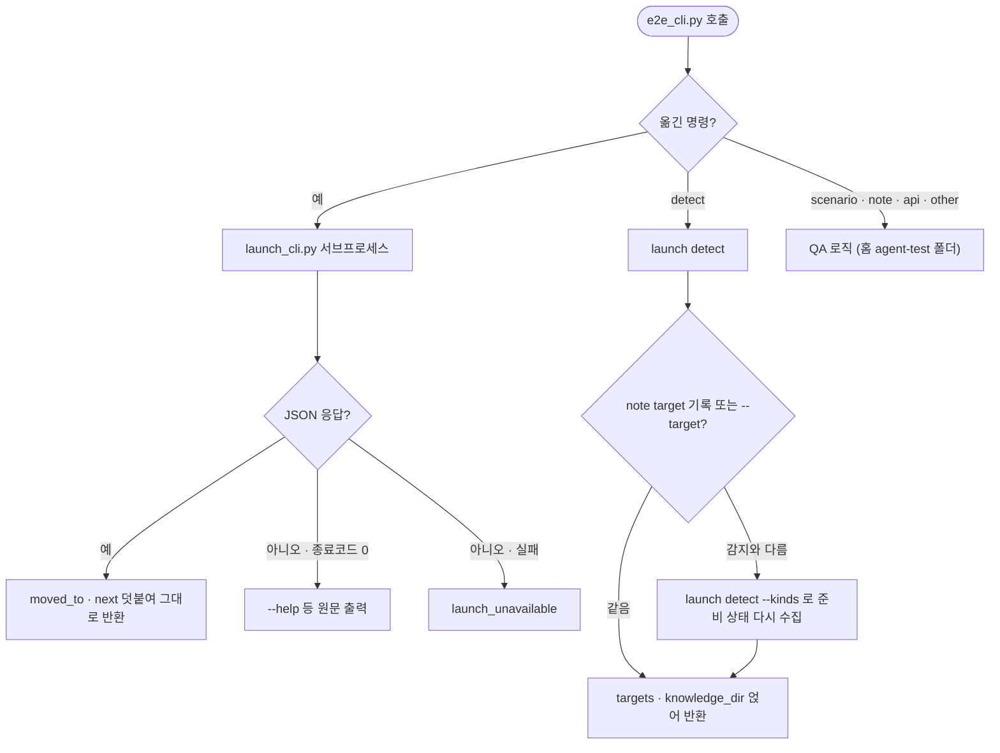

# pro-agent-test에 실행과 캡처가 두 벌 남는다: pro-launch 위로 옮기고 QA 절차만 남긴다

## 개요

#629에서 실행·캡처 능력이 `pro-launch`로 떨어져 나간 뒤, `pro-agent-test`의 `e2e_cli.py`를 **QA 명령만 남기도록** 줄였다(3,056줄 → 1,300줄). 남은 명령은 detect·scenario·note·api·other다. 옮긴 명령(doctor·devices·device·web·access·db·logs·shrink·get-output-path)은 한 마이너 버전 동안 `launch_cli.py`로 그대로 넘겨주고, 결과에 `moved_to`와 `next`를 붙여 새 자리를 알린다. 문서도 "QA"와 "실행·캡처" 두 덩어리로 다시 썼다. 기존 결함 2개(없는 명령 `note trap` 안내, 빠져 있던 스크립트 탐색 스니펫)와, 작업 중 발견한 낡은 `actions` 예시도 함께 고쳤다.

## 기능 흐름

## 변경 사항

### 코드
- `skills/pro-agent-test/scripts/e2e_cli.py`: 넘겨주기 층(`delegate`)과 detect 덧씌우기를 새로 넣었다. 옮긴 명령의 코드, 기기·웹·DB·로그·접속 기록, 타겟 감지를 지웠다. 저수준은 `scripts/common/`(proc·access·state·http)에서 가져온다. `get-output-path`를 옛 이름으로 부르면 `--skill agent-test`를 붙여 산출물이 계속 agent-test 폴더에 쌓인다.
- `scripts/common/http.py`(신규): 단건 요청. launch `http`와 agent-test `api`가 같이 쓴다.
- `skills/pro-launch/scripts/launch_cli.py`: `detect --kinds`를 추가했다(부르는 쪽이 이미 알면 그 종류의 정보를 모은다). HTTP는 `common/http`를 쓴다.

### 문서
- `skills/pro-agent-test/SKILL.md`: 두 스킬 경로(`{SCRIPTS}` · `{LAUNCH}`)를 한 번에 찾는 스니펫을 **복원**했다. 예전에는 "아래 5줄로 찾는다"는 말만 있고 스니펫이 없었다. "실행 수단 한눈에"는 QA와 실행·캡처 두 표로 나눴다. 캡처는 `app shot`으로, db·logs·web·access는 `{LAUNCH}`로 바꿨다. 축 2(실패 주입)에 `web route` 연출(빈 목록·500·지연)을 넣었다.
- references: `target-app.md`·`target-web.md`는 붙는 법을 pro-launch 참조로 넘기고 QA 전용 내용만 남겨 다시 썼다. `target-server.md`는 "DB에 붙는 법" 절을 요약하고 링크로 바꿨다. `devices.md`·`reporting.md`·`social-login.md`는 명령만 교체했다.
- `social-login.md`: 없는 명령 `note trap`을 → `note pitfall`로 고쳤다.
- `target-other.md`: #622 이후 위치 인자가 하나로 합쳐졌는데 남아 있던 `actions resolve-branch … 0 0 0 {브랜치}`와 `joblog {run_id} {job_id}` 예시를 고쳤다.
- `skills/references/doc-output-path.md`: agent-test 자리를 여는 CLI를 `launch_cli.py get-output-path --skill agent-test`로 바꾸고 launch 행을 추가했다.
- `CLAUDE.md`: CLI 표에서 agent-test의 서브커맨드를 갱신했다.

### 테스트
- `test_e2e_cli.py`: 옮긴 내부를 직접 보던 14건을 뺐다(launch 테스트에 같은 계약이 있다). 넘겨주기 계약 테스트 9건을 추가했다: 옛 명령 6종의 `moved_to`·`next`, 산출물이 agent-test 폴더에 남는지, `--help` 통과, 기록된 타겟의 준비 상태 수집.
- `test_launch_cli.py`: 감지 테스트 4건과 `--kinds`, "훅이 다음 호출의 이동에도 살아남는다"(local_only)를 옮겨 왔다.
- `test_cli_signatures_doc_sync.py`: `CLI_TO_SKILL`에 e2e_cli를 추가했다. 목록에 없던 것으로, 남은 모든 서브커맨드가 SKILL.md에 있는지 본다.

## 주요 구현 내용

- **스킬끼리 파이썬 import는 하지 않는다.** 넘겨주기 층은 같은 플러그인 안의 `../pro-launch/scripts/launch_cli.py`를 서브프로세스로 부른다. 표준입력은 넘기지 않는다(`stdin=DEVNULL`).
- **옮긴 명령은 argparse에 올리지 않고 이름으로 가로챈다.** 인자 계약이 pro-launch 쪽에 있으므로 두 곳에 같은 인자 정의를 두지 않는다. 옮긴 명령 목록은 `--help`의 epilog로 보여 준다.
- **넘겨주기 층이 `--help`를 실패로 오판하던 것을 고쳤다.** JSON이 아닌 정상 출력(종료코드 0)은 그대로 흘려보낸다. 테스트를 돌리다 발견했다.
- **기록된 타겟이 감지와 다르면 준비 상태를 다시 모은다.** "서버가 템플릿을 뿌린다 → web도 밟는다"고 적어 두어도 launch가 web을 감지하지 않았으면 브라우저 준비 상태가 빠졌다. `detect --kinds`로 다시 부른다.

### 실측

옛 명령만으로 끝까지 밟았다(임시 레포, 실제 에뮬레이터·Chromium).

| 단계 | 결과 |
|---|---|
| `e2e_cli get-output-path` | 넘겨짐, 실행 폴더가 `…/agent-test/…` |
| `e2e_cli device list` | 기기 1대, `moved_to: launch_cli.py device` |
| `launch_cli app shot --device emulator-5554` | 같은 실행 폴더의 `screenshots/`에 저장 |
| `e2e_cli web open → assert → shot → console → close` | 전부 ok. stealth 표식(`webdriver=false`) 확인 |
| `e2e_cli scenario init` | QA 명령은 그대로 동작 |

테스트: 파이썬 950 통과 / 77 건너뜀(CI 모드), 노드 402 통과. 로컬 실제 브라우저 포함 pro-launch + agent-test 152건 통과.

## 주의사항

- **넘겨주기 층은 다음 마이너에서 지운다.** 그때 `MOVED`와 `delegate`, 관련 테스트 6건을 함께 뺀다. 그 전까지 옛 문서나 습관으로 부르는 호출은 결과의 `next`에서 새 자리를 보게 된다.
- `e2e_cli`는 이제 `pro-launch`가 함께 설치돼 있어야 옮긴 명령과 `detect`가 동작한다. 같은 플러그인으로 배포되므로 정상 설치라면 문제가 없다. 없으면 `launch_unavailable`로 원인을 알린다.
- 쌓인 지식(learned.json·시나리오·flows)은 계속 `~/.projectops/agent-test/<repo>/`에 있다. 기기·브라우저·접속 정보만 `launch`로 옮겨 갔다.
