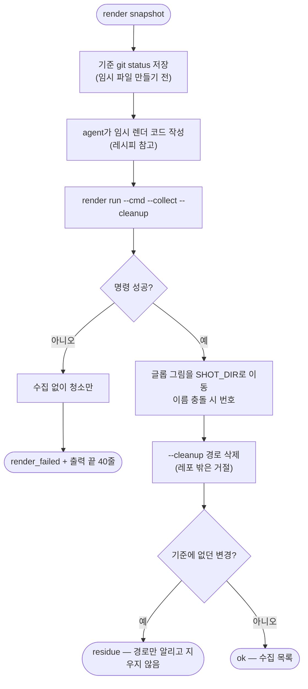

# 빈 목록, 실패 같은 상태를 연출해 찍을 방법이 없다: pro-launch render와 스택별 레시피

## 개요

실기기 캡처로는 만들기 어려운 엣지 상태(빈 목록·실패·긴 글자·권한 거부)를 **코드로 그려 찍는** 경로를 `pro-launch`에 넣었다. 렌더 코드는 agent가 레시피를 보고 대상 레포에 임시로 짠다. `render run`은 실행·수집·청소·흔적 검사만 한다. 상태 관리 방식(Riverpod·Bloc 등)을 스크립트가 알아맞히지 않는다. 스택별 레시피는 `references/render.md`에 모았다. 브라우저 쪽 연출(`web route`·`web viewport`)은 #629에서 넣었고, 이번에 실제 React 앱에서 확인했다.

## 기능 흐름

## 변경 사항

- `skills/pro-launch/scripts/launch_cli.py`
  - `render snapshot`: 임시 파일을 만들기 **전에** 흔적 검사 기준(`git status --porcelain --untracked-files=all`)을 상태 폴더에 뜬다.
  - `render run --cmd --collect --cleanup [--cwd] [--timeout]`: 실행 → 수집(png·jpg·webp, 레포 안만) → 청소 → 흔적 검사. 기준은 snapshot이 있으면 그것을, 없으면 실행 직전을 쓴다. snapshot은 한 번 쓰고 지운다.
- `skills/pro-launch/references/render.md`(신규): 순서 계약, 결과 코드별 대응, 스택별 레시피를 적었다. 스택은 Flutter·React/Next·React Native·Spring 서버 렌더·순수 API·ASCII 폴백이다. Flutter 함정 표에는 노란 이중 밑줄, `pumpAndSettle` 무한 대기, `dart format` diff, 한글 □, 오버플로 실패를 넣었다.
- `skills/pro-launch/SKILL.md`: 명령 표에 render를 추가하고 "코드로 상태를 그려 찍는다" 절을 새로 썼다.
- `skills/pro-launch/tests/test_launch_cli.py`: render 7건. 수집·청소·흔적 없음, 실패 시 청소만, snapshot 뒤 빠뜨린 파일이 흔적으로 잡히고 지우지 않음, snapshot이 없을 때 원래 있던 변경은 흔적 아님, 이름 충돌, 레포 밖 청소 거절, `--cmd` 필수를 본다.

## 주요 구현 내용

- **기준을 임시 파일 만들기 전에 뜨는 `snapshot`을 새로 넣었다.** 설계대로 `run` 직전에만 기준을 뜨면, agent가 먼저 만든 임시 파일이 기준에 들어간다. 그러면 `--cleanup`에서 빠뜨린 파일이 남아도 흔적으로 잡히지 않는다. 실제로 짜 보다가 발견했다. snapshot이 없어도 `run`은 동작한다(그때는 청소 대상 밖에서 새로 생긴 것만 잡는다).
- **흔적은 지우지 않는다.** 같은 레포에서 다른 세션이 작업 중일 수 있다. 경로만 알리고 판단은 agent에게 맡긴다.
- **실패해도 청소한다.** 임시 테스트 파일이 남으면 그것이 곧 흔적이다.
- **수집한 그림은 원본 PNG 그대로다.** 픽셀 대조(figma-verify)에 원본이 필요하다. 이슈에 붙일 때만 `shrink`한다.

### 실측

| 확인 | 결과 |
|---|---|
| Flutter 앱(한 사용자 프로젝트, `flutter_test_config.dart` 있음): 대화상자 3상태(짧은 문구·긴 문구·빈 문구)를 임시 위젯 테스트로 `render run` | 3장 수집, `residue: []`, 임시 폴더 삭제 확인. 한글 폰트 정상. 빈 문구 상태에서 제목·본문 자리가 비어 공간이 남는 것이 보였다(요청서의 재료) |
| 같은 레포에서 임시 파일을 `lib/`에 일부러 하나 더 남김 | `code: residue`, `["?? client/lib/_launch_leftover.dart"]`. 스크립트는 지우지 않았고, 직접 정리했다 |
| 실제 React(Vite) 앱의 랭킹 화면 — 백엔드 없이 `web route` | 가짜 목록 3건(긴 닉네임 말줄임 확인), 500, 모바일 폭 빈 목록을 모두 연출해 캡처. 레포 파일 변경 없음 |
| 테스트 | 파이썬 957 통과 / 77 건너뜀(CI 모드) |

실측 중 대상 앱에서 본 것(그 레포의 결함이라 여기서는 기록만 한다): 빈 목록 문구가 배경과 대비가 낮아 거의 안 보였다. API 실패(500)를 빈 배열로 삼켜서 실패와 빈 목록이 화면에서 구분되지 않았다. **상태를 연출하면 이런 것이 보인다**는 예이기도 하다.

## 주의사항

- 앞서 시도한 다른 React 앱은 로컬 `node_modules`에 의존성이 빠져 뜨지 않았다. 남의 레포에 `npm install`로 손대지 않고 다른 앱으로 확인했다.
- `web route`는 **브라우저 요청만** 바꾼다. 서버 렌더(SSR)로 이미 채워진 데이터는 못 바꾼다. 레시피 함정 표에 적었다.
- 배포 파일에 사용자 프로젝트 이름을 쓰지 않는 규칙(`test_no_foreign_project_names`)에 맞춰, 레시피의 출처 표기를 중립 표현으로 바꿨다.
