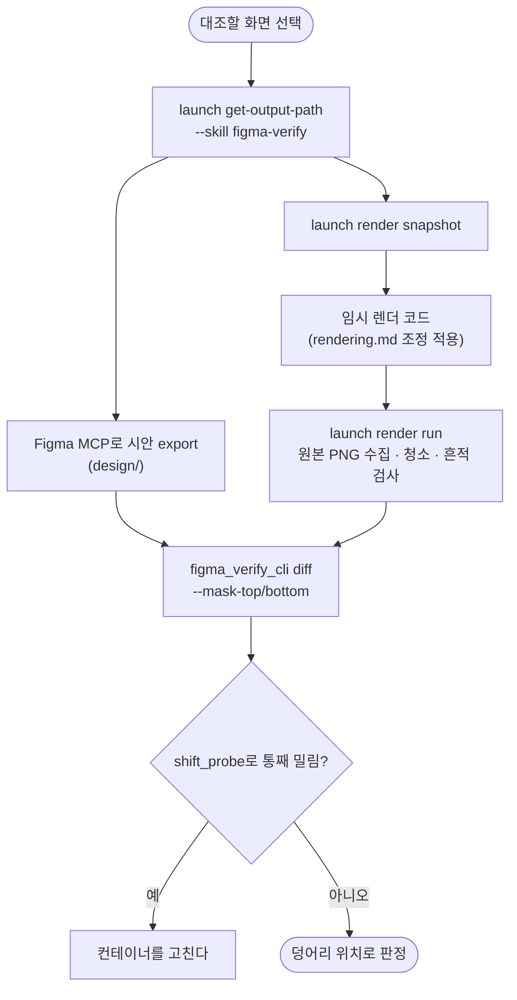

# pro-figma-verify의 화면 찍는 안내가 pro-agent-test와 두 벌이다: pro-launch로 일원화

## 개요

`pro-figma-verify/references/rendering.md`가 따로 안내하던 캡처 방법(`simctl`·`adb`·Playwright locator)을 `pro-launch`(`app shot`·`web shot`·`render run`) 호출로 바꿨다. 시안 대조에만 필요한 조정(원본 PNG, 3배 캡처, 기기 실측 안전영역, 회귀 골든과의 분리)은 남겼고, 각각 **"왜 pro-launch 기본값과 다른가"**를 한 줄씩 적었다. SKILL.md Phase 5·6의 캡처 단계도 pro-launch 호출로 옮겼다.

## 기능 흐름

## 변경 사항

- `skills/pro-figma-verify/references/rendering.md`
  - 머리에 "찍는 것은 pro-launch"를 명시하고, 기본값과 다른 점을 표로 모았다(형식·크기, 배율, 안전영역, 상태바, 내용, 렌더 폴더).
  - 스택별 절에서 캡처 명령을 pro-launch로 바꿨다. Flutter는 `render snapshot/run`, 웹은 `web viewport 393x852` + `web shot --keep-format [--selector]`, React Native는 `app shot --keep-format`다.
  - 웹 3배는 pro-launch 브라우저로 **못 한다**는 점을 적었다. 이어 붙는 브라우저라 `deviceScaleFactor`가 1로 고정되기 때문이다. 대신 `deviceScaleFactor: 3` Playwright 스크립트를 임시로 짜 `render run`으로 돌린다.
  - 그대로 남긴 것: Flutter RepaintBoundary 3배(dpr 1 + textScaler), "골든 파일은 대조 대상이 아니다", 안전영역 여백 + 마스크, 글꼴 로드 대기, 애니메이션 정지, RN `initialMetrics`·`captureRef`.
- `skills/pro-figma-verify/SKILL.md`: "딸린 문서" 설명과 Phase 5(캡처 명령 블록 추가), Phase 6(3배 방법)을 고쳤다.
- `figma_verify_cli.py get-output-path`: 이미 `common/paths.py`의 `resolve_output_path("figma-verify", …)`를 쓰고 있음을 확인했다. 변경은 없다.

## 주요 구현 내용

- **대조용은 원본 PNG다.** pro-launch 캡처 기본값(긴 변 1200 WebP)은 세션 토큰을 아끼려는 것이다. 그대로 대조하면 픽셀이 뭉개진다. 모든 대조용 호출에 `--keep-format`을 붙였다.
- **찍는 법이 새로 생기면 pro-launch `render.md`에 레시피로 넣는다**고 적었다. 두 곳에 다시 갈라지지 않게 하려는 것이다.
- figma-verify 안에 옛 캡처 안내(`simctl io`·`screencap`)가 남지 않았음을 grep으로 확인했다(0건).

### 실측 — 새 안내대로 끝까지

사용자의 Flutter 앱 한 화면(로그인, Figma 238:1808)으로 수행했다.

| 단계 | 결과 |
|---|---|
| `launch get-output-path --skill figma-verify` | 추적 제외 폴더 생성 |
| Figma MCP `download_figma_images`(1배) | 시안 export 393×852 |
| `render snapshot` → 레포의 기존 대조 테스트를 임시 폴더로 복사(골든 경로만 `shots/`로) → `render run --plain-name '로그인 …'` | 렌더 1장 수집(393×852), `residue: []`. **레포의 원래 골든은 건드리지 않았다** |
| `figma_verify_cli diff --mask-top 54 --mask-bottom 34` | 다른 픽셀 3.97%, 덩어리 11개, `shift_probe` 이동 없음 |

차이 그림에서 글자 가장자리 차이는 래스터라이저 차이(무해)다. 세 로그인 버튼 오른쪽 위에 같은 모양의 덩어리 3개가 있다. 시안과 렌더 중 한쪽에만 있는 요소다. 이건 그 앱에서 확인할 거리이며, 새 경로가 실제 결함 후보를 짚어 낸다는 예다.

테스트: `pytest skills/ scripts/tests/` 327 통과.

## 주의사항

- 레포에 있는 `test/figma/*.png` 같은 파일은 **시안 export가 아니라 앱 렌더 골든**일 수 있다. 이름에 노드 id가 붙어 있어도 그렇다. 실측 중 헷갈리기 쉬웠다. 시안은 Figma MCP로 받는다(rendering.md "골든 파일은 대조 대상이 아니다").
- 실측 증거(시안·렌더·차이 그림)는 이 레포의 `docs/projectops/figma-verify/` 추적 제외 폴더에 있고 커밋하지 않았다. 다른 프로젝트 화면이라 이슈에도 올리지 않았다.
