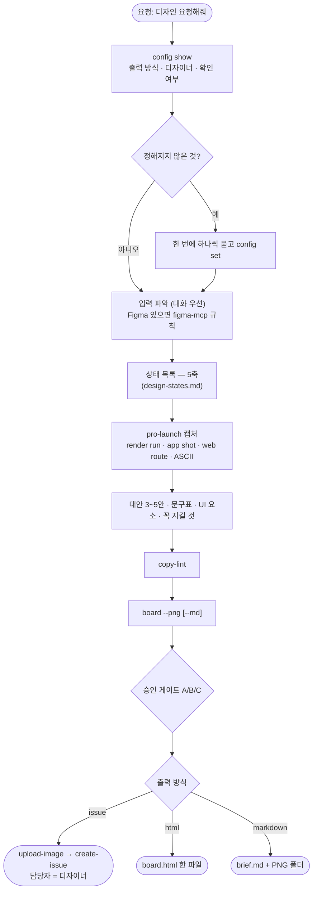

# 시안보다 먼저 만든 화면을 디자이너에게 넘길 요청서를 매번 손으로 만든다: pro-design-brief 신설

## 개요

시안 없이 먼저 만든 화면의 **디자인 요청서**를 만드는 작업 스킬 `pro-design-brief`를 새로 만들었다. 설정 판정 → 입력 파악 → 상태 목록 → 캡처(pro-launch) → 대안·문구·UI 요소·꼭 지킬 것 → 보드(HTML → 주제별 PNG) → 게시(승인 게이트) 순서다. 디자이너에게 **정답이 아니라 생각할 재료**를 넘긴다. 결과물은 반드시 디자이너가 받아 보는 형태(디자인 이슈 / HTML 한 장 / md 폴더)로 끝난다. 판단은 agent가 하고, `design_brief_cli.py`는 설정 해석·보드 조립·기계 검사만 한다.

## 기능 흐름

## 변경 사항

### 새 스킬 `skills/pro-design-brief/`
- `SKILL.md`: 단계 0~6, 네 스킬 스크립트를 한 번에 찾는 블록, 보드 데이터 JSON 형식, `issue` 게시 순서와 본문 뼈대(디자인 요청 템플릿 🖌️🎯📋💡🙋), 실패 경로, 하지 않는 것.
- `scripts/design_brief_cli.py`
  - `config show|set`: `design_brief` 독립 섹션을 해석한다. 우선순위는 `projects[]` 일치 → 기본값 → 첫 실행 판정이다. `match`는 `owner/repo` 또는 레포 절대경로다. 저장은 전체를 읽고 해당 키만 바꾼다.
  - `get-output-path`: 증거 폴더(추적 제외)에 요청서 자리를 만든다.
  - `board --data --out [--png] [--md]`: 데이터 JSON을 HTML 보드로 조립하고, 주제별 PNG와 markdown을 만든다. 데이터가 없는 주제는 만들지 않는다.
  - `copy-lint`: em dash · 가운뎃점 남발 · 번역투 · 과장 · 레포 금지어를 검사한다. 법적 문구는 건너뛴다.
  - `ascii`: 박스 문자 와이어를 그린다. 한글은 두 칸으로 센다.
- `assets/board.html`: 보드 템플릿(목차 탭, 상태 태그, 대안 카드).
- `tests/test_design_brief_cli.py`: 18건(PNG 1건은 `local_only`).

### 등록
- `scripts/common/paths.py` `EVIDENCE_SKILLS`에 `design-brief`
- `skills/references/config-rules.md` §7에 `design_brief` 스키마, `skills/config.json.example`에 예시
- `scripts/tests/test_cli_signatures_doc_sync.py` `CLI_TO_SKILL`에 등록
- `CLAUDE.md`(스킬 표·CLI 표·라우팅)와 `README.md`

## 주요 구현 내용

- **보드는 HTML로 짜고 브라우저로 찍는다.** 사람이 #419에서 PIL로 좌표를 계산해 합칠 때는 글자 배치를 여러 번 고쳐야 했다. PNG는 pro-launch가 받아 둔 Chromium으로 **섹션마다** 찍는다(GitHub에서 한 장이 너무 크면 안 읽힌다). 브라우저가 없으면 멈추지 않고 HTML·md로 낸다.
- **실측으로 고친 것 네 가지.**

| 문제 | 원인 | 고친 것 |
|---|---|---|
| HTML이 16MB | 같은 캡처를 네 칸에 쓰면서 칸마다 base64를 박았다 | 그림은 한 번만 싣고 id로 잇는다. 싣기 전에 긴 변 1440으로 줄인다 → 3.7MB · 1.1MB |
| 상태 표 PNG 세로 10,886px | 표 안에 전체 크기 캡처 | 표 안 그림은 섬네일 → 5,890px |
| ASCII 오른쪽 선이 브라우저에서 어긋남 | 글꼴이 한글을 정확히 두 칸 폭으로 그리지 않는다 | 전각 글자를 `2ch` 폭 칸에 넣는다 |
| 보드가 파일에 두 번 실림 | 템플릿 주석에 자리표시 글자가 그대로 있어 치환이 두 번 일어났다 | 주석에서 빼고 치환은 한 번만(회귀 테스트) |

- 디자이너 자동 판정이 이슈 템플릿의 자리표시(`**디자인**: 이름`)를 담당자로 읽던 것을 걸렀다.

### 실측 1 — elum #419를 이 스킬로 다시 만들었다 (게시하지 않고 로컬 산출물로 비교)

앱 버전 표시(설정 `앱 정보` 줄 · 로그인 구석)를 대상으로 했다. `render run`으로 12장 + 대안 재렌더 3장을 모았고 흔적은 없었다. 보드 7주제, HTML 1.1MB였다.

| | 사람이 만든 #419 | 이 스킬 |
|---|---|---|
| 현재 구현 캡처 · 확대 조각 | ✅ | ✅ (4배 확대 5개) |
| 배치 대안 | 로그인 4안 · 설정 3안(모두 렌더) | 로그인 4안(렌더) · 설정 B안(ASCII — 새 화면이라 코드 없음). 설정 C안(옛 모양)은 넣지 않았다 |
| 꼭 지킬 것 | 4개 (대화·이슈에서) | 6개 — **코드 주석에서 자동 수집**: '문의하기'를 일부러 뺀 합의 예외(#312), 목록 자리 근거(#418), 레포 디자인 원칙(터치 48, 설명 글자 최소 14) |
| **엣지 상태** | 없음 | 버전을 못 읽을 때 · 긴 버전 문자열 · 글자 200% · 작은 폰 · iOS/Android |
| **발견** | — | 글자 200%에서 로그인 제목이 **로고와 겹치고 잘린다**(버튼 아이콘도 겹침) · 설정 약관 줄이 두 줄로 꺾인다 → "별개 문제"로 분리해 표시 |
| 원칙 충돌 | — | 로그인 버전 10px vs 원칙 "설명 최소 14" → 결함이 아니라 **질문**으로 올림 |
| 문구표 | 없음 | `앱 정보` vs `버전 정보`, 버전 표기 3안, 못 읽을 때 **문구 필요**, 약관 줄은 **법적 문구**로 고정 |
| UI 요소 · 개발 영향 표 | 본문 서술 | 표로 정리(고르면 따로 드는 개발 포함) |

이 과정에서 레시피 함정도 실제로 밟았다. 대안 글자를 `Material` 밖에 그려 **노란 이중 밑줄**이 붙었다(render.md 함정 표 첫 줄). 감싸서 다시 렌더했다.

### 실측 2 — React 앱 랭킹 화면 (`web route`로 연출)

가짜 목록·빈 목록(모바일)·500 캡처로 요청서를 만들었다. 대안 B(실패 분리 + 다시 시도 + 오류 코드)는 ASCII로 그렸다. 문구표에서 "아직 랭킹 데이터가 없습니다" → "데이터는 사용자 말이 아니다" 후보를 제시했다. **500이 빈 목록과 같은 화면**이라는 점이 요청의 핵심이 됐다.

### 실측 3 — GitHub 없이 HTML로

임시 HOME에서 `config set --destination html`로 저장하고 해석이 `project` 출처로 나오는 것을 확인했다(사용자의 실제 설정 파일은 건드리지 않았다). 만들어진 `board.html`을 pro-launch 브라우저로 열어 목차 탭을 눌렀을 때 해당 주제만 보이는 것을 확인했다. `--md`로 `brief.md` + PNG 폴더도 만들었다.

결과 JSON에는 산출물 위치(`html` · `png[]` · `md` 경로)가 실제로 들어 있다.

## 주의사항

- **이번 실측에서는 이슈를 실제로 만들지 않았다.** 다른 사람 레포에 디자인 이슈를 올리는 것은 되돌리기 어려운 외부 작업이라 로컬 산출물로 비교했다. `issue` 게시는 기존 `pro-github` 스크립트(`upload-image` → `create-issue`)를 그대로 쓴다.
- 설정 B안처럼 **코드가 아직 없는 안**은 ASCII로만 전한다(글꼴·간격·색은 담지 못한다고 보드에 표시된다).
- 실측 산출물은 이 레포의 `docs/projectops/design-brief/`(추적 제외)에 있고 커밋하지 않았다.
