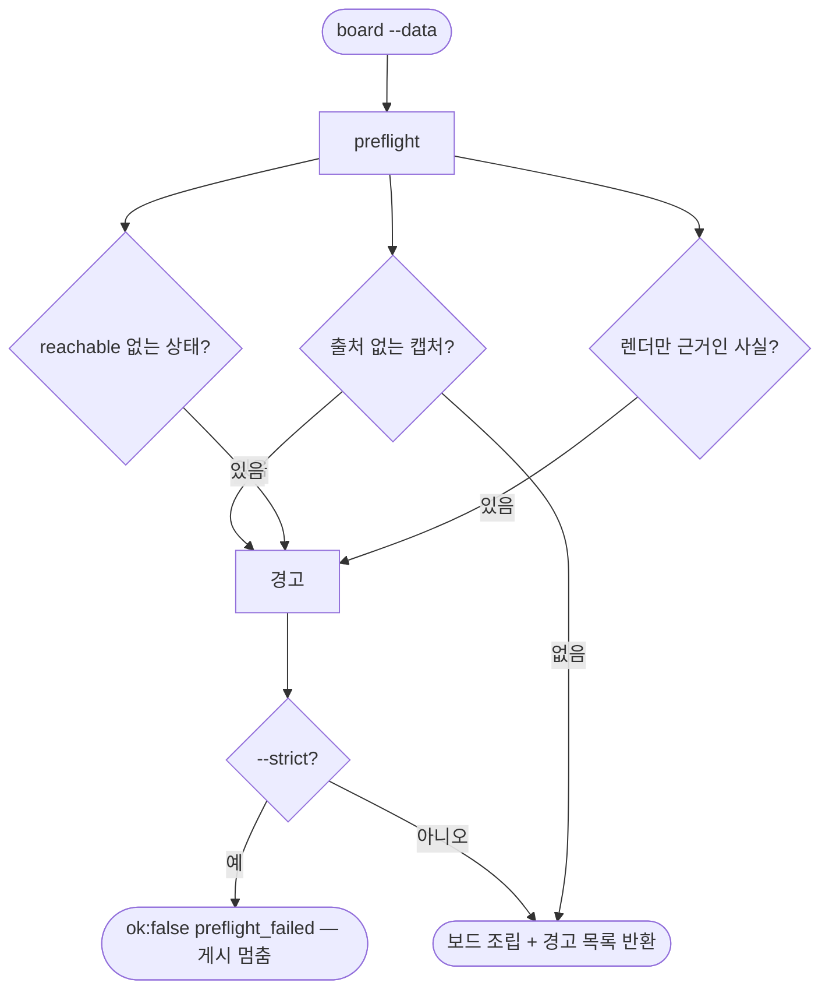

# pro-design-brief가 렌더 캡처를 사실로 쓰고 도달할 수 없는 상태까지 요청한다

## 개요

실사용 검수(#634 댓글 두 개)에서 나온 요구를 반영했다. 요청서가 **렌더 캡처를 "지금 앱은 이렇다"의 근거로 쓰고**, **지금 흐름에서 나오지 않는 상태까지 요청**하던 문제다. 보드 데이터에 캡처 출처·도달 가능성·근거가 붙은 사실을 더해 보드에 표시한다. 빠뜨린 표시와 렌더만 근거인 주장은 `preflight`가 짚는다. `copy-lint` 금지어 오탐(`아이` → `아이콘`)도 고쳤다.

## 기능 흐름

## 변경 사항

- `skills/pro-design-brief/scripts/design_brief_cli.py`
  - 보드 데이터 필드를 늘렸다. 캡처 `source`(`render`·`device`·`server`·`design`·`ascii`), 상태 `reachable`(`yes`·`old_data`·`unknown`), `facts[]`(`claim`·`basis`·`ref`)다.
  - 보드에 캡처 출처 태그(`렌더 · 가짜 데이터`·`실기기`…), 상태 도달 가능성 태그, 요약의 "지금 앱에 대한 사실과 근거" 표가 나온다. markdown 출력에도 같이 나온다.
  - `preflight(data)`: 출처 없는 캡처, 도달 가능성을 안 적은 상태, 예전 데이터에만 나오는 상태, 렌더·무근거 사실, 근거 위치 없는 사실을 경고한다. `board` 결과의 `preflight`로 돌려주고, `--strict`면 `ok:false`다.
  - `copy-lint`: 금지어를 **낱말 단위**로 본다. 앞 글자가 한글·영숫자면 다른 낱말이다. 뒤에는 조사(은·는·이·가·에게·들…)만 허용한다.
- `skills/pro-design-brief/assets/board.html`: 출처 태그 색.
- `skills/pro-design-brief/SKILL.md`
  - 2단계: 도달 가능성을 코드로 확인한다(입력 경로가 지금도 있는가). 서버가 내려주는 문구(공지·약관)도 상태에 넣는다.
  - 3단계: **"렌더는 연출, 사실은 실기기"** 표, 수치는 운영 API·설정에서, 캡처마다 `source`, 사실은 `facts[]`에 근거와 함께.
  - 5단계: `preflight`가 비어야 게시하고, 게시 직전에는 `--strict`를 쓴다.
  - 6단계: 게시 뒤 틀린 것을 발견하면 본문 수정 + **정정 댓글**("처음에 쓴 것 → 실제 → 근거" + 실기기 캡처).
  - 실패 경로: 실기기로 확인할 수 없는 사실은 렌더로 대신 단정하지 않는다.
- `skills/references/design-states.md`: 도달 가능성, 서버 문구, "렌더는 근거가 아니다".
- `tests/test_design_brief_cli.py`: 13건 추가(총 31건).

## 주요 구현 내용

- **판단은 agent, 빠뜨린 표시는 기계.** 어떤 사실이 실기기로 확인됐는지를 스크립트가 알 수는 없다. 대신 agent가 근거 종류를 적게 하고, 적지 않았거나 렌더만 적은 것을 센다. 실측 검수에서 틀린 7건은 모두 "렌더만 근거"인 주장이었다.
- **경고가 있어도 조립은 한다.** 작업 중에는 보드를 계속 봐야 하므로 기본은 경고만 돌려준다. `--strict`는 게시 직전의 문지기다.

### 확인

- #419 재작성 보드 데이터(표시 없음)에 `--strict`: `preflight_failed`, 경고 24건.
- 출처·도달 가능성을 채우고 사실 두 개(코드 근거 1 · 렌더 근거 1)를 넣으니 경고 **1건**만 남았다. "글자 200%에서 로그인 제목이 로고와 겹친다 — 렌더(가짜 데이터)는 근거가 아니다". 실측 검수에서 틀렸던 것과 같은 유형이다.
- 보드 PNG에 출처 태그·도달 가능성 태그·근거 표가 그려지는 것을 눈으로 확인했다.
- 금지어 판정: `아이콘`·`아이디` 통과, `우리 아이`·`아이가`·`아이들이`·`아이에게는` 검출.
- 테스트: 파이썬 988 통과 / 78 건너뜀(CI 모드), 노드 402 통과.

## 주의사항

- 붙여 쓴 금지어(`우리아이`)는 놓친다. 오탐보다 놓침이 낫다고 보고 앞 글자 경계를 뒀다.
- 이미 만든 보드 데이터는 새 필드가 없어 경고가 많이 나온다. 기존 동작은 바뀌지 않는다(경고만 추가, `--strict`는 선택).
