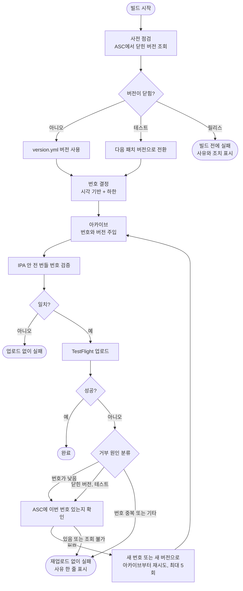

# 출시 후 iOS 테스트 빌드가 닫힌 버전 이름을 써서 TestFlight 업로드가 거부됨

## 개요

앱이 App Store에서 승인되면 그 버전의 TestFlight 등록이 닫혀, 이후 iOS 테스트 빌드가 12~18분 빌드를 마친 뒤 마지막 업로드에서만 거부되던 문제를 고쳤다. 버전 이름만 고치면 뒤따르는 릴리스의 빌드 번호와 충돌하므로 **버전 이름과 빌드 번호를 한 묶음으로** 재설계했다. Twin-Fang/elum에서 실제 TestFlight와 Firebase로 실측 검증을 마쳤고 v4.25.0으로 릴리스했다 (PR #655).

## 기능 흐름

## 변경 사항

### 새 스크립트 (`.github/scripts/`)
- `build_number.py`: 번호 규칙의 유일한 위치. `max(2024-01-01 UTC부터 지난 초, ASC 최근 번호+1, Apple 거부 요구값+1)`. 시간은 거꾸로 가지 않으므로 나중에 뽑은 번호가 항상 더 크다.
- `asc_client.py`: App Store Connect 조회의 유일한 위치. JWT(ES256)를 openssl로 서명하고, 모든 네트워크 예외를 `AscError`로 감싸 호출자가 폴백하게 한다.
- `ios_release.py`: 닫힌 버전 사전 점검(`precheck-version`), Apple 거부 분류(`classify-error`), 아카이브부터 업로드까지 재시도(`archive-upload`), 상태 조회(`asc-status`).

### 워크플로 (`project-types/flutter/`)
- `IOS-TEST-TESTFLIGHT`, `IOS-TESTFLIGHT`: 빌드 job과 배포 job을 한 job으로 합쳐 번호 거부 시 아카이브부터 다시 할 수 있게 했다. 준비 job이 고정한 커밋 SHA로 체크아웃한다.
- `ANDROID-TEST-APK`: 번호를 시각 기반으로, 커밋을 실제 HEAD로.
- `APP-BUILD-TRIGGER`: 옛 방식 번호 계산을 옛 빌더 호환용으로 유지 (아래 함정 참고).
- `IOS-ASC-STATUS` (신규, #651): 버전 상태와 최근 빌드 번호를 수동으로 조회하는 리눅스 러너 워크플로.

### 기타
- `src/core/copy/simple.js`: 새 스크립트 3개를 사용자 레포로 복사.
- `ExportOptions.plist` 템플릿과 마법사 폴백: `manageAppVersionAndBuildNumber=false`.
- `breaking-changes.json` 4.25.0 경고, 문서 4개, `CLAUDE.md` 에이전트 규칙.

## 주요 구현 내용

- **왜 버전 이름만 고치면 안 되나**: 테스트 빌드가 아직 릴리스되지 않은 다음 패치에 큰 번호를 먼저 올리면, 뒤따르는 릴리스의 번호가 같은 버전 안에서 더 작아 거부된다. 그래서 번호 체계도 함께 바꿨다.
- **왜 시각 기반 번호인가**: 외부 API 없이 동시 빌드와 순서 역전에서도 항상 증가한다. ASC 최대값+1은 정렬 기준이 문서에 없고 방금 올린 빌드가 목록에 늦게 뜨며 키 권한이 불확실해 버렸다.
- **왜 빌드와 배포를 한 job으로**: 서명과 업로드가 다른 job이면 IPA를 아티팩트로 넘긴 뒤라 번호 거부 시 재아카이브가 불가능하다.
- **왜 전 번들 번호 검증**: 앱 확장은 본체와 번호가 같아야 Apple이 받는다. 서명 후 IPA를 풀어 검증해 업로드 전에 막는다.
- **재업로드 방지**: 재시도 전에 ASC에 이번 번호가 있는지 확인하고, 있거나 조회가 안 되면 재시도하지 않고 실패한다. 중복 업로드 사고를 피하는 쪽으로 기울였다.

## 실측 결과 (Twin-Fang/elum, 모노레포 `APP_ROOT=client`)

| 시나리오 | 결과 |
|---|---|
| 닫힌 버전에서 iOS 테스트 빌드 | 통과. 2.1.2를 2.1.3으로 자동 전환, 번호 `86695215`, 1회 업로드 |
| iOS 동시 빌드 2건 | 통과. 번호 `86696503`, `86696524`, 각 1회 |
| Android 테스트 (Firebase) | 통과. 번호 `86695757`, 커밋이 실제 HEAD |
| 번호와 무관한 실패 | 통과. 재시도와 업로드 없이 실패 |
| 릴리스, 닫힌 버전 | 통과. 약 1분 만에 빌드 전 차단 |
| 릴리스, 열린 버전 `store_only` | 통과. 번호 `86699347`, 심사 제출 없음 |

## 주의사항

### E2E와 독립 리뷰에서 발견해 고친 것
1. **트리거가 빈 `build_number`를 보내면 옛 수정본 빌더가 깨진다.** 마법사는 사용자가 수정한 워크플로를 덮어쓰지 않아(`skipped-conflict`) 트리거만 새 것이고 빌더는 옛 것인 저장소가 생긴다. 옛 빌더는 payload 값을 빌드 번호로 그대로 쓴다. 옛 번호 계산을 되살리고 회귀 테스트를 추가했다. 설계 스펙의 "빈 값 호환" 판단이 틀렸던 부분이다.
2. 실패 사유가 xcodebuild 끝 배너(`** ARCHIVE FAILED **`)만 보이던 것을 실제 error 줄로.
3. ASC 연결 오류 일부가 폴백을 뚫던 것, 테스트 빌드의 `store_only`가 `setdefault`라 약하던 것, 아무것도 검증 못 하던 테스트 1건.

### 남은 위험
- **번호 중복(duplicate)은 사실상 자동 재시도되지 않는다.** 재업로드 방지 확인이 그 번호를 찾으면 멈춘다. 다시 실행하면 새 번호를 쓴다. 승인된 설계의 결과이며 문서는 이에 맞췄다.
- 실측하지 못한 것: Apple의 실제 "번호가 낮다" 거부 경로(문서 샘플로만 단위 테스트), 앱 확장이 있는 앱의 번들 검증, `store_prepare`와 `store_submit`, `IOS-ASC-STATUS`의 실제 러너 실행.
- iOS 빌드 번호는 한 번 올라가면 되돌릴 수 없다. elum은 이미 약 8,700만대로 올라갔다.
- 사용자가 수정한 워크플로는 자동 갱신되지 않아 직접 병합해야 한다. 병합하지 않으면 옛 동작 그대로 동작한다. 안내 개선은 #654.

### 릴리스 후 발견 (이번 변경과 무관)
- v4.25.0 릴리스는 성공했지만 **npm 배포가 실패했다**: `Unsupported GitHub Actions source repository visibility: "private"`. 저장소가 비공개로 바뀌었는데 `npm publish --provenance`는 공개 저장소만 허용한다. 09-29부터 연속 실패이며 마지막 성공은 4.22.0이다. 따라서 npm에는 4.23~4.25가 아직 없다. 공개 여부 또는 provenance 옵션에 대한 결정이 필요하다.

### 후속 이슈
보안 #645(트리거 작성자 권한 검사), #646(스크립트 주입) 외 #647~#654.
