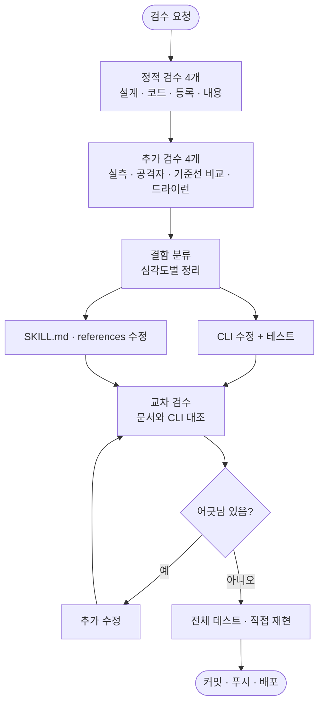

# pro-oss-consult 출시 전 검수 결과 반영

## 개요
`pro-oss-consult`(오픈소스 레포 컨설팅 스킬)를 8개 관점으로 검수해 나온 결함을 전부 고쳐 v4.28.0으로 배포했다. 악성 저장소를 점검할 때 임의 명령이 실행되는 경로와 레포 밖 파일이 출력에 섞이는 경로를 막았고, 문서가 가리키던 도구가 실제로는 없던 수정 단계에 `repo-update`·`label` 서브커맨드를 만들어 채웠다. 테스트는 12개에서 115개로 늘었다.

## 기능 흐름

## 변경 사항

### 보안 (`skills/pro-oss-consult/scripts/oss_cli.py`)
- `_git()`: 모든 git 호출에 `core.fsmonitor=false`, `core.hooksPath=/dev/null`, `core.pager=cat`, `core.quotepath=false` 등을 붙이고 `GIT_CONFIG_NOSYSTEM`·`GIT_OPTIONAL_LOCKS`·`GIT_TERMINAL_PROMPT`를 설정한다.
- 추적된 심볼릭 링크, 레포 밖으로 나가는 경로, 일반 파일이 아닌 것, 대용량 파일을 읽지 않는다. `--commits`는 1~1000, `OWNER/REPO`에 경로·쿼리 문자가 섞이면 거부한다.
- `_out()`에서 문자열을 500자(README 앞부분 12000자, 문서 head 4000자)로 자르고 방향 전환·제로폭 제어문자를 제거한다. 처리한 양은 `data.sanitized`로 알린다.
- `collect`에 `untrusted`(외부 작성 텍스트 필드 경로)와 `untrusted_notice`를 추가했다.

### 사실 정확도
- `is_template`·`created_at` 추가, 건강 파일 이름을 대소문자·하이픈·확장자 변형까지 인식(cli/cli `CODE-OF-CONDUCT.md`, flask `CHANGES.rst`).
- Gradle·Maven처럼 읽지 못하는 매니페스트는 `unsupported_manifests`·`manifests_seen`으로 구분해 빈 `{}`와 "의존성 없음"이 섞이지 않게 했다.
- 릴리스의 prerelease·draft·tags 구분, `privacy_policy` 탐색 위치 확대, `co_change`의 한글 파일명 이스케이프 수정, 버전 동기화·생성 파일·대형 커밋 제외.
- `list-repos <계정>`이 타 조직 레포를 섞던 것을 owner 필터로 분리하고 `other_owners`로 알린다.

### 안정성
- 선택 엔드포인트 실패를 `data.errors`로 흡수하고 `code: partial`(ok는 true)로 낸다. 타임아웃 20초, 네트워크·rate limit·권한·404를 구분하고 모든 오류 JSON에 `next`를 채운다. 절단은 `truncated`/`capped`로 표시한다.
- `scripts/common/gh_client.py`: `request_json`, `GitHubNetworkError`, `GitHubAPIError.headers`를 **추가만** 했다(기존 시그니처 불변).

### 수정 도구 신설
- `repo-update`(About·homepage·topics·Discussions), `label`(create·rename·recolor). 둘 다 `--dry-run`과 `before` 기록을 제공한다.
- 구현하지 않은 것: 가시성 변경, 레포 삭제·이름 변경·보관, 기본 브랜치 변경, 이슈 닫기, 라벨 삭제, description·homepage·topics 비우기. 한글 상태 라벨(작업전 등)은 `protected_label`로 거부한다.

### 문서
- `SKILL.md`: 신뢰 경계, 승인 두 종류 분리, 시작 전 질문, review 모드 정의, batch 기준, 실패 경로 표, 저장 위치, description 트리거와 슬래시 명령(`/pro-oss-consult`) 정정.
- `references/*`: 성숙도 M/S 대응, 성격별 조정표, SECURITY·CODE_OF_CONDUCT를 초안 등급으로, 라벨 이름 변경 전 참조 확인, 공식 문서로 확인한 사실과 "확인 필요" 구분.
- `skills/references/approval-and-questions.md`, `README.md`, `docs/SKILLS.md`, `CLAUDE.md`, 설계 문서 `docs/superpowers/specs/2026-10-01-pro-oss-consult-design.md`.

## 주요 구현 내용
- **사실만 모으고 판단은 에이전트가 한다**는 원칙을 유지했다. 새로 넣은 필드(`errors`, `truncated`, `unsupported_manifests` 등)도 모두 "어디를 못 봤는지"를 알리는 사실이고, 점수·등급·통과 여부 키는 테스트로 금지했다.
- **승인은 두 종류다.** 보고서 저장은 자동 승인 설정을 따르지만, 레포를 바꾸는 조치는 설정과 무관하게 항상 레포마다 개별 승인이며 "전부 적용" 같은 포괄 위임은 받지 않는다. 문서 규칙일 뿐이라 CLI 쪽에서도 삭제성 동작 자체를 만들지 않았다.
- 수정 경로를 `/pro-github`에 맡기지 않고 스킬 안에 둔 이유는, `github_cli.py`에 레포 단위 About·topics·라벨 기능이 없어서 문서가 없는 기능을 가리키고 있었기 때문이다.

## 주의사항
- **`git ls-files`만으로 임의 명령이 실행된다.** 악성 `.git/config`의 `core.fsmonitor`가 재현됐다. `local-facts`를 고칠 때 git 호출을 새로 추가하면 반드시 `_git()`을 거쳐야 한다. 회귀 테스트가 마커 파일로 검증한다.
- **`GIT_CONFIG_GLOBAL=/dev/null` 때문에** 소유자가 다른 clone은 `safe.directory`가 무시되어 `git_error`가 난다. 보안을 우선한 선택이라 일부러 둔 동작이다.
- **`SKILL.md`의 CLI 준비 블록에서 `cd "$SCRIPTS"` 하지 않는다.** 작업 디렉터리가 스킬 폴더로 바뀌면 보고서 경로가 엉뚱한 레포 기준이 된다. 호출은 `"$SCRIPTS/oss_cli.py"`처럼 `_cli.py`와 서브커맨드가 한 줄에 있어야 `test_output_tracking.py`가 호출로 인정한다(`$CLI` 변수로 줄이면 테스트가 실패한다).
- **`repo-update`의 `has_discussions`는 공식 문서로 PATCH 파라미터임을 확인하지 못했다.** 적용 후 재조회로 검증하고 반영되지 않으면 `warnings`로 알린다. About 350자 한도도 공식 확인이 안 돼 보수적으로 거부한다.
- **references의 "확인 필요" 표기를 지우지 않는다.** 스토어가 README 앵커 URL을 개인정보처리방침으로 받는지, 라벨 이름 변경 시 이슈 연결 유지 여부 등은 확인되지 않은 채 남아 있다. 조사 통계(Trending 18개 등)는 원본을 못 봐서 날짜만 붙였다.
- **"아직 릴리스되지 않아 로딩이 안 된다"는 초기 진단은 틀렸다.** 1·2차 커밋은 이미 v4.27.0에 있었고 원인은 로컬 플러그인 캐시(4.24.0)가 오래된 것이었다. 스킬이 안 보이면 배포 여부보다 설치된 플러그인 버전을 먼저 확인한다.
- 추후 개선: `natural_language_strings`는 여러 줄 docstring 안의 한글을 주석으로 거르지 못한다(줄 단위 휴리스틱). Gradle 버전 카탈로그·`Podfile`·`Package.swift`는 의존성 이름을 읽지 않는다.
