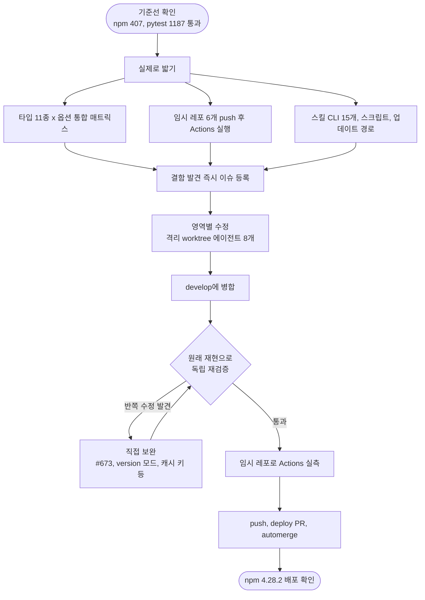

# 대대적 기능테스트 총괄: 결함 54건 수정과 배포

## 개요

projectops(npx 마법사, 워크플로 템플릿, 스킬 CLI)를 남의 프로젝트에 설치했을 때 누구에게나 동작하는지 실제로 밟아 검증했고, 찾은 결함 54건(#665~#713, #717~#721)을 모두 수정해 v4.28.1과 v4.28.2로 배포했다. 테스트 코드가 이미 초록이었는데도 빈 HOME, 빈 프로젝트, 실제 GitHub 임시 레포에서 실행해야만 드러나는 결함이 대부분이었다. 수정 후에는 이슈 본문의 원래 재현 절차로 독립 재검증을 한 번 더 거쳤고, 워크플로 수정은 임시 레포를 다시 만들어 실제 GitHub Actions에서 확인했다.

## 기능 흐름

## 변경 사항

### 마법사와 CLI 입력 검증 (src/)
- `src/cli/args.js`: `--mode`, `--paths`, `--deploy-branch`, `--project-version` 값을 검증한다. 잘못된 값은 오류와 종료코드 1로 막고, `v1.0.0`은 접두사를 떼어 받으며, 브랜치명은 유니코드 글자까지 허용한다. (#665, #673, #674, #719)
- `src/cli/errors.js`(신규), `src/core/assets.js`: 네트워크, git 없음, 권한 문제를 스택 트레이스 대신 원인 한 줄로 안내하고, 읽기 전용 폴더는 쓰기 불가로 구분한다. (#672, #720)
- `src/core/version-yml.js`, `src/commands/full.js`, `workflows.js`, `version.js`: `deploy:` 블록이 `template`을 가로채던 구조를 바로잡고, 재실행과 `version` 모드에서도 사용자가 고친 값을 보존한다. (#670)
- `src/core/detect-fs.js`: `.github` 스크립트가 타입 판정에 섞이지 않게 하고, 구버전 단수 키 `project_type`을 복원한다. (#671, #718)
- `src/ui/summary.js`와 워크플로 교체 집계: README가 없으면 안내를 정정하고, 기준점 없이 교체한 파일은 백업 위치를 알린다. (#676, #677)

### 버전 관리 스크립트 (.github/scripts/version_manager.py)
- 갱신 실패를 성공으로 출력하던 문제, `v` 접두사, 프리릴리스, 후행 공백 처리. (#678, #685)
- Pods, build, node_modules를 탐색에서 제외하고, build.gradle과 pyproject.toml에서는 해당 테이블의 version만 고친다. (#679, #680, #681)
- CRLF, BOM, JSON 들여쓰기를 보존하고 이미 같은 값이면 파일을 쓰지 않는다. (#675, #682, #683)
- 블록 리스트와 작은따옴표 경로를 읽고, Python 3.9에서도 기동한다. (#684, #695)
- `project_paths`가 저장소 밖을 가리키면 거부한다. (#673 보완)
- react-native는 `versionCode`와 `CFBundleVersion`도 `version_code`와 맞춘다. (#721)

### 체인지로그, 이슈헬퍼, 빌드프로파일, iOS
- 커밋 타입 대소문자 구분 제거와 Merge 커밋 제외, export 폴백 정규식, CHANGELOG.json 중복·손상 방어, 릴리스 노트 절단 안전성. (#686~#689)
- 브랜치명 정규화(일본어, 악센트 보존)와 commit_template의 따옴표 안 `#`. (#690, #691, #717)
- `.env`의 `export`와 공백 형식 키 검증, 불리언·null 처리. (#692, #693)
- Apple 오류 코드를 문맥이 있을 때만 분류. (#694)

### 워크플로
- 배포 워크플로 7종(Spring, Python, Flutter 4종, React)에 첫 단계 사전 점검을 넣어 없는 Secret, Dockerfile, gradlew를 등록 방법과 함께 알린다. (#666)
- Projects Sync는 Secret이나 `PROJECT_URL`이 없으면 건너뛰고(#667), 라벨 동기화는 설치 직후 실행되며 사용자 라벨을 지우지 않고 동시 실행을 직렬화한다. (#668)
- React CI/CICD는 npm, pnpm, yarn, lock 없음을 감지한다. (#669)
- `setup-java` v3를 v4로 올렸다. (#696)

### 스킬 CLI
- github, commit, note: 접두 브랜치 번호 추출, `set-labels`가 기존 라벨을 지우던 문제, 422 상세 오류, 범위 검증. (#697~#702, #713)
- pro-launch, pro-agent-test, design-brief, figma-verify: 한글 URL, 실패 명령을 성공으로 보고하던 문제, 경로 이탈, 인자 오류 JSON 통일, 응답 상태 노출. (#703~#712)

## 주요 구현 내용

- **발견 방식**: 빈 HOME과 빈 프로젝트로 타입 11종, deploy 3종, publish 5종, intent 5종, 모드 6종을 두 번씩 실행하고, 공개 임시 레포에 push해 Actions를 실제로 돌렸다. 병렬 에이전트로 업데이트 경로(약 45개), 스크립트 엣지(약 240개), 스킬 CLI(약 120개 서브커맨드, 약 700회)를 밟았다.
- **수정 방식**: 영역별로 파일이 겹치지 않게 나눠 격리 worktree에서 수정하고, 이슈마다 재현, 회귀 테스트(수정 전 실패 확인), 최소 수정, 전체 테스트, 커밋 순서를 지켰다.
- **검증 방식**: 개발자가 쓴 테스트가 아니라 이슈 본문의 재현 명령으로 독립 재검증을 했다. 이 단계에서 아래의 반쪽 수정이 나왔다.

## 주의사항

### 검증에서 새로 드러난 반쪽 수정
- **#673**: 마법사 `--paths` 인자만 검증하고 `version.yml`의 `project_paths`를 읽는 `version_manager`는 저장소 밖을 계속 수정했다. 테스트는 통과 상태였다.
- **`--mode version`**: `deploy:` 블록을 지웠다(#670과 같은 종류).
- **라벨 동기화**: `skip-delete`를 지정하지 않으면 사용자 라벨을 삭제하고, main과 develop이 동시에 push되면 서로 충돌했다.
- **React 캐시 키**: lock 파일이 없으면 키가 고정되어 옛 캐시를 재사용했다.

### 검증 환경의 함정
- 마법사는 기본적으로 GitHub에서 템플릿을 받아오므로, 로컬 수정이 임시 레포에 반영되지 않은 채 "수정이 안 먹었다"로 보일 수 있다. 워크플로 검증은 로컬 템플릿 소스를 주입해야 한다.

### 동작이 바뀌는 곳
- `--mode`, `--paths`, `--deploy-branch`, `--project-version`은 잘못된 값을 거부한다. 기존에 우연히 통과하던 값은 이제 오류가 난다.
- `version:` 키가 없으면 `0.0.0`으로 진행하지 않고 오류가 난다.
- 존재하지 않는 라벨만 `set-labels`로 주면 기존 라벨을 지우지 않고 거절한다.
- `skill_id`가 산출물 스킬 집합에 없으면 거절한다. 새 산출물 스킬은 `EVIDENCE_SKILLS` 또는 `DOCUMENT_SKILLS`에 등록해야 한다.
- react-native의 `increment`, `increment-code`, `set`이 빌드 번호 파일도 수정한다.

### 검증 범위와 남은 것
- **실제 Actions 확인**: Python, Spring, Flutter 4종, React의 사전 점검, Projects Sync, 라벨 생성, React lock 없음 경로.
- **미검증**: Windows, Linux GNU 도구, 대화형(TTY) 마법사, 외부 AI provider 실호출, 스토어 실배포, pnpm/yarn 실제 설치 경로, `setup-java` v4의 실제 Actions 실행.
- **범위 밖으로 둔 것**: Spring NONSTOP과 PR-PREVIEW 계열의 사전 점검.

### 작업 중 실수
- 원격이 이미 같은 기준인데 `git pull --rebase`를 돌려 병합 커밋이 평탄화되며 충돌했다. push된 것은 rebase 전 브랜치 끝이었고 중단해 복구했다. 병합 커밋이 많은 브랜치에서는 원격이 앞서지 않았으면 pull을 생략한다.

## 배포

- v4.28.1 (PR #714): 49건 수정.
- v4.28.2 (PR #722): React CICD 사전 점검, 후속 5건(#717~#721), 한글 브랜치와 RN 빌드 번호 등.
- npm `projectops@4.28.2` 게시 확인, main push의 넓은 CI(3 OS x 2 Node) 통과.
