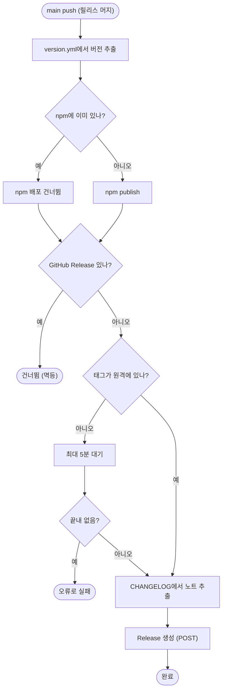

# 오픈소스 컨설팅 후속: README 교정, dependabot, GitHub Release 자동 생성

## 개요
오픈소스 관점 점검(6축 채점)에서 나온 결함 중 바로 고칠 수 있는 것을 처리했습니다. README·SKILLS의 낡은 서술 교정, dependabot 추가, About·topics 갱신, 열린 이슈 정책 안내(#737), main push 때 GitHub Release 자동 생성(#738), 루트 잔여 파일 `pr_body.md` 제거(#741)입니다. 릴리스 PR #742로 `v4.29.1`이 배포됐습니다.

## 기능 흐름

## 변경 사항

### 문서 (#737)
- `README.md`: 없는 `/pro-flutter-e2e` 행을 `/pro-agent-test`로 교체했습니다. 체인지로그 설명에서 종료된 GitHub Models를 빼고 현재 생성 사다리(PR 본문 → OpenAI 호환 키 → 커밋 분석)로 고쳤습니다. 지원 절에 "완료된 이슈는 닫지 않고 `작업완료` 라벨로 표시"를 한 줄 추가했습니다.
- `docs/SKILLS.md`: `pro-flutter-e2e` 섹션을 `pro-agent-test`(코드를 고치지 않고 결함만 보고) 설명으로 바꾸고, 사이클 표의 항목도 같이 바꿨습니다.
- `.github/dependabot.yml` 신규: github-actions와 npm을 주 1회 갱신하고 열린 PR은 각 5개로 제한합니다.

### 워크플로우 (#738)
- `.github/workflows/PROJECT-TEMPLATE-NPM-PUBLISH.yaml`: `contents: write` 권한과 "GitHub Release 생성 (멱등)" 단계를 추가했습니다.

### 정리 (#741)
- `pr_body.md` 삭제: 변경로그 스크립트가 실행 중에 만드는 파일 이름이지만, 추적 중이던 사본은 어디서도 읽지 않았습니다.

### 레포 설정 (원격)
- About 설명을 Agent Skills와 npx를 포함하도록 바꾸고 topics에 `agent-skills`, `gemini-cli`, `codex-cli`를 추가했습니다. 이전 값: 설명 `GitHub 자동화 템플릿 - PR/이슈/빌드를 AI가 관리하는 스마트 워크플로우`, topics 10개(`ai-agent`, `automation`, `ci-cd`, `claude-code`, `devops`, `flutter`, `github-actions`, `npx`, `spring-boot`, `template`).

## 주요 구현 내용
- **Release 생성 위치**: 공통 워크플로우(`RELEASE-CHANGELOG`)가 아니라 이 레포 전용 `NPM-PUBLISH`에 넣었습니다. 공통 쪽에 넣으면 이 템플릿을 설치한 모든 레포의 릴리스 동작이 예고 없이 바뀝니다.
- **멱등성**: 같은 버전의 Release가 이미 있으면 건너뜁니다. 재실행해도 중복 생성되지 않습니다.
- **태그 대기**: 태그는 `RELEASE-CHANGELOG`가 만들기 때문에 push 시점에 아직 없을 수 있습니다. 15초 간격으로 최대 5분 기다리고, 끝내 없으면 조용히 넘어가지 않고 오류로 실패합니다. 조용히 넘기면 Release가 영영 누락됩니다.
- **노트 출처**: `changelog_manager.py export`가 만든 CHANGELOG 내용을 씁니다. 비어 있으면 CHANGELOG.md 안내 문구로 대체합니다.
- **GitHub API 호출**: `gh` CLI 대신 `curl`과 `jq`를 사용했습니다.

## 검증
- `npm test` 434개 통과, pytest 1506개 통과(76개는 환경 때문에 건너뜀, 실패 0).
- 릴리스 PR #742가 automerge로 `v4.29.1` 확정, 머지됐습니다.
- **실측**: `NPM-PUBLISH` 실행에서 "GitHub Release 생성" 단계가 success, Release `v4.29.1` 생성 확인(Releases 탭에 정식 릴리스가 생겼습니다). npm에도 `4.29.1`이 올라갔습니다(`00:10:06Z`).
- Dependabot이 push 직후 `github_actions`, `npm_and_yarn` 업데이트 실행을 시작했습니다.

## 주의사항
- **dependabot PR이 올라옵니다.** 주 1회, 종류별 최대 5개입니다. 이 레포는 워크플로우가 많아 처음에는 `github-actions` PR이 여러 개 나올 수 있습니다. 노이즈로 느껴지면 `open-pull-requests-limit`을 줄이면 됩니다.
- **Release 노트는 커밋 분석(commit provider) 결과입니다.** 사용자 언어로 다듬은 문장이 아니라 커밋 제목 기반이라 거칩니다. 다듬으려면 릴리스 노트를 선제 작성하는 방식으로 바꿔야 합니다.
- **npm 레지스트리 전파 지연**: 배포 직후 약 1분 동안 `npm view`가 404/이전 버전을 돌려줍니다. 배포 확인은 레지스트리 API에서 `time` 필드를 보는 편이 정확합니다.
- **`semver_auto`와 커밋 타입**: #738은 설치 대상 레포에 영향이 없는 이 레포 전용 변경이라 `feat`가 아니라 `chore`로 커밋했습니다. `feat`로 하면 불필요하게 minor가 올라갑니다.
- **남은 작업**: #739(SECURITY.md)는 이 레포의 Private vulnerability reporting이 꺼져 있어, 설정을 켠 뒤 신고 링크로 작성해야 합니다. #740(README 데모 GIF)은 녹화가 필요합니다. 둘 다 `작업전` 상태로 남겨 뒀습니다.
