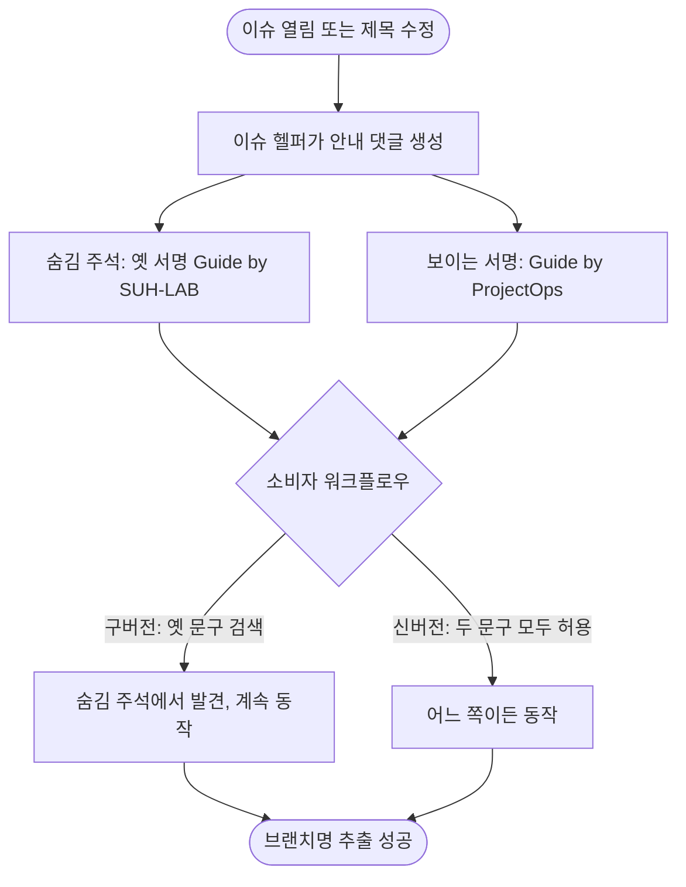

# 오픈소스 컨설팅 후속 2차: SECURITY.md, README 데모·다국어, 안내 댓글 서명, deploy PR 오인 수정

## 개요
1차(#737, #738, #741)에서 남은 항목과, 작업 중 드러난 문제를 처리했습니다. 대상 이슈는 #739(SECURITY.md), #740(README 데모), #749(안내 댓글 서명), #750(README 다국어와 스킬 개수), #751(deploy PR 오인)입니다. 릴리스 PR #752로 `v4.30.0`이 배포됐습니다.

## 기능 흐름

## 변경 사항

### SECURITY.md (#739)
- `SECURITY.md`: GitHub 비공개 취약점 신고 링크, 지원 버전, 신고 범위를 안내합니다. 신고 기능이 켜진 것을 API로 확인한 뒤 작성했고, 임의 연락처는 만들지 않았습니다.
- `src/core/exclusions.js`, `.github/scripts/template_initializer.py`: 사용자 프로젝트로 복사되지 않도록 제외 목록 두 곳에 등록했습니다.

### README 데모 (#740)
- `docs/images/demo/`: 이 레포의 실제 이슈, 자동 안내 댓글, 구현 보고서, 릴리스 PR, Release 화면 캡처 5장과 GIF 1개(약 380KB).
- `README.md`: "실제로 이렇게 동작합니다" 절, 배지, "알아둘 것", 보안 신고 안내를 추가하고 낡은 체인지로그 설명을 교정했습니다.

### 이슈 안내 댓글 서명 (#749)
- `.github/scripts/issue_helper.py`: 기본 서명을 `Guide by ProjectOps`로 바꾸고 `guide_signature` 설정을 추가했습니다. 옛 서명은 눈에 보이지 않는 HTML 주석으로 남겨 구버전 소비자가 계속 동작합니다.
- Flutter 앱 빌드 트리거는 새 문구와 옛 문구를 모두 인식합니다. 나머지 문서와 주석을 정리했습니다.

### README 다국어와 스킬 개수 (#750)
- `docs/i18n/README.{en,zh-CN,ja}.md`: 영어, 간체 중국어, 일본어 번역본. 정본은 한국어이고, 링크된 `docs/` 가이드는 아직 한국어뿐이라고 명시했습니다.
- 스킬 개수를 17종에서 20종으로 바로잡았습니다. 표에 17개, 이전 세대 경로 3개가 따로 있어서 17종이 틀린 숫자였습니다. `docs/SKILLS.md`에는 빠져 있던 `/pro-launch`, `/pro-design-brief` 항목을 추가했습니다.

### deploy PR 오인 (#751)
- `scripts/common/gh_client.py`: deploy PR 탐색에 head 필터를 추가하고, head가 없으면 `dependabot/`, `renovate/` 브랜치를 제외합니다. CLI에 `--head`를 추가했습니다.
- `.github/dependabot.yml`: 대상 브랜치를 `develop`으로 지정하고 메이저 버전 업데이트는 제외했습니다.
- `.github/scripts/test/test_common_workflow_copies.py`: 루트 공통 워크플로우와 `project-types/common/` 원본의 동일성을 검사합니다.

## 주요 구현 내용
- **호환을 깨지 않고 서명을 바꾼 방법**: 서명 문구는 사람이 보는 글이면서 구버전 워크플로우가 `includes`로 찾는 표식이었습니다. 기본값만 바꾸면 업데이트되지 않은 레포가 깨지므로, 옛 문구를 숨김 주석으로 남겼습니다. 같은 이유로 `!`(호환 깨짐)을 붙이지 않았습니다.
- **독립 리뷰 후 보정**: 변경분을 별도 리뷰어에게 맡겼습니다. Critical과 Major는 없었고, 다음을 반영했습니다.
  - 숨김 주석이 서명 바로 아래 줄에 끼면 제목 렌더링이 깨지므로 서명 위로 옮겼습니다. 실제 화면에서 제목으로 렌더링되는 것을 확인했습니다.
  - Release 단계를 별도 job으로 분리해 `contents: write`를 그 job에만 줬고, 5xx와 429는 재시도, 422는 존재 확인 후 성공 처리합니다.
  - README의 "17종"은 리뷰가 짚어 20종으로 정정했습니다.
- **반영하지 않은 것**: Spring과 Python PR 프리뷰의 표식 환경변수는 호환 주석 덕에 그대로 동작해서 수정하지 않았습니다.

## 검증
- `npm test` 434개 통과, pytest 1698개 통과(76개는 환경 때문에 건너뜀, 실패 0).
- **실서버 확인**: `v4.30.0` Release가 새 분리 job으로 자동 생성됐습니다. npm에 `4.30.0`이 올라갔고, 이슈 헬퍼가 `#749`에 새 서명 댓글을 달았습니다. `main`에서 번역본, GIF, SECURITY.md 파일을 확인했고, raw 이미지 URL은 모두 200입니다.
- `deploy-status`는 수정 전에는 Dependabot PR #748을 돌려줬고, 수정 후에는 `no_pr`을 돌려줍니다.

## 주의사항
- **Dependabot이 열려 있던 PR 6개를 스스로 닫았습니다.** 새 설정(메이저 제외)이 `main`에 반영된 뒤 확인했고, 열린 PR은 0개입니다. 메이저 업데이트(`checkout 5→7` 등)는 이 템플릿을 설치한 레포의 동작을 바꿀 수 있어 의도적으로 제외했습니다. 앞으로 minor/patch 업데이트 PR은 `develop` 대상으로 올라옵니다.
- **번역본은 정본(한국어)과 따로 관리됩니다.** README를 고치면 번역본도 같이 고쳐야 하고, 이를 강제하는 장치는 아직 없습니다. 번역본에는 자동 버전 갱신 구간이 없어 버전은 배지로 표시합니다.
- **옛 서명 호환 주석은 당분간 유지해야 합니다.** 구버전 소비자가 모두 사라졌다고 확인되기 전에는 제거하지 마세요.
- **README 이미지는 `main`의 raw URL을 씁니다.** `develop`에서 미리 볼 때는 이미지가 보이지 않을 수 있습니다.
