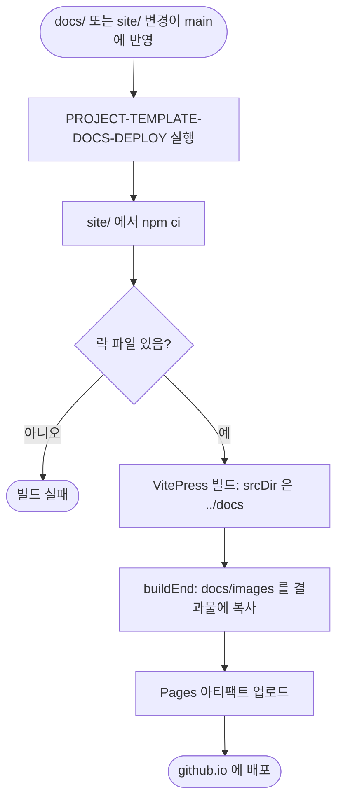

# GitHub Pages 문서 사이트 구축과 README·CLI 재구성

## 개요
README 한 장에 의존하던 문서 구조를 바꿨습니다. VitePress 문서 사이트(`https://cassiiopeia.github.io/projectops/`)를 만들어 `docs/`를 단일 원본으로 배포하고, README는 히어로 이미지, 실제 CLI 실행 GIF, "30초 시작" 표 중심으로 줄였습니다. CLI 옵션 상세는 `docs/CLI.md`로 분리했습니다. 대상 이슈는 #754(README·CLI)와 #755(문서 사이트)이고, 릴리스 PR #757로 배포됐습니다.

## 기능 흐름

## 변경 사항

### 문서 사이트 (#755)
- `site/`: VitePress 설정(`config.mts`), 테마(`custom.css`: 브랜드 색, 한국어 줄바꿈), 자체 `package.json`과 `package-lock.json`. 원본은 `../docs` 하나이고 내용을 복제하지 않습니다. 내부 산출물(`docs/projectops`, `docs/superpowers` 등)은 제외했습니다.
- `docs/index.md`, `docs/en/`: 한국어·영어 랜딩, 시작하기, 영어 CLI 요약. `docs/GETTING-STARTED.md`.
- `.github/workflows/PROJECT-TEMPLATE-DOCS-DEPLOY.yaml`: main push 때 빌드해 Pages에 배포합니다. 이 레포 전용입니다.
- `src/core/exclusions.js`, `.github/scripts/template_initializer.py`: `site/`와 배포 워크플로우를 사용자 프로젝트로 복사하지 않게 제외했습니다.
- 레포 설정: Pages 소스를 GitHub Actions로 지정했고, 소개의 홈페이지를 npm 페이지에서 문서 사이트로 바꿨습니다(이전 값 `https://www.npmjs.com/package/projectops`).

### README와 CLI (#754)
- `README.md`: 히어로 이미지, 언어 전환, 배지, "30초 시작" 표, 실제 CLI GIF 순으로 재구성했습니다. 20종 스킬 표, 흐름도, 설치 상세는 접었습니다.
- `docs/i18n/README.{en,zh-CN,ja}.md`: 같은 구성으로 맞췄습니다.
- `docs/CLI.md`: 대화형 마법사 단계, 비대화형 실행, 모드, 옵션, `doctor`, 업데이트 동작. `--help`와 실제 실행 결과만 근거로 썼습니다.
- `docs/images/`: 히어로(한국어·영어), 터미널 카드, CLI GIF 2개.

## 주요 구현 내용
- **CLI GIF는 실제 실행을 녹화한 것입니다.** `vhs`로 샘플 Spring 프로젝트에서 대화형 마법사 전 과정과 `--mode full --force`, `--mode doctor`를 녹화했습니다. 화면에는 `npx projectops`로 보이지만 레포의 `bin/projectops.js`를 같은 코드로 실행했고, origin은 push 단계가 성공하도록 로컬 bare 저장소를 썼습니다.
- **`docs/images`는 그대로는 배포되지 않습니다.** VitePress는 `public` 밖의 파일을 결과물에 복사하지 않아 hero 이미지가 404가 될 뻔했습니다. 원본을 `docs/images` 하나로 유지하려고 `buildEnd` 훅에서 결과물로 복사합니다. 본문 이미지는 상대 경로라 빌드가 알아서 처리합니다.
- **터미널 카드 이미지**는 실제 `doctor` 출력 줄을 줄여 담은 것입니다(마지막 줄 "확인된 문제 없음" 포함).

## 검증
- `npm test` 434개 통과, pytest 통과(신규 테스트 포함).
- **로컬 렌더 확인**: 사이트를 빌드·프리뷰해 랜딩, CLI 페이지, 한국어 줄바꿈을 브라우저로 직접 봤습니다.
- **실서버 확인**: `https://cassiiopeia.github.io/projectops/`의 `/`, `/CLI`, `/GETTING-STARTED`, `/en/`, `/en/cli`, `/images/hero-card.webp`가 모두 200입니다. GitHub 저장소 화면에서 README 히어로, 언어 전환, 배지, GIF가 렌더링되는 것을 봤습니다.

## 주의사항
- **첫 Pages 배포는 실패했습니다.** 루트 `.gitignore`가 `package-lock.json`을 무시해서 `git add site`가 사이트 락 파일을 조용히 빼먹었고, CI의 `npm ci`가 "락 파일 없음"으로 실패했습니다. 로컬에는 파일이 있어서 로컬 빌드로는 잡히지 않았습니다. `!site/package-lock.json` 예외를 추가하고, 락 파일이 추적되는지 검사하는 테스트를 넣어 재발을 막았습니다.
- **리브랜딩 가드 테스트를 한 곳 고쳤습니다.** 소문자 `cassiiopeia` 잔재를 막는 테스트가 정식 Pages 도메인(`cassiiopeia.github.io`)까지 막아서, 그 도메인만 예외로 허용했습니다.
- **번역본은 정본(한국어)과 따로 관리됩니다.** README를 고치면 번역본도 같이 고쳐야 하고 이를 강제하는 장치는 아직 없습니다. 사이트의 영어 문서는 랜딩, 시작하기, CLI 요약뿐이고, 나머지 상세 가이드와 중국어·일본어 사이트는 아직 한국어만입니다.
- **CLI GIF는 크고 글자가 작습니다.** 터미널을 120열 정도로 녹화해서 README 폭에서는 글자가 작게 보입니다. 클릭하면 원본 크기로 볼 수 있습니다. 또 마법사 UI 자체가 한국어라 영어·중국어·일본어 README에서도 한국어 화면이 나옵니다.
- **데모 GIF의 2번 프레임(안내 댓글)은 새 서명 `Guide by ProjectOps`가 적용된 화면으로 교체**했습니다(#740). 옛 서명 `Guide by SUH-LAB`이 보이는 화면은 남아 있지 않습니다.
