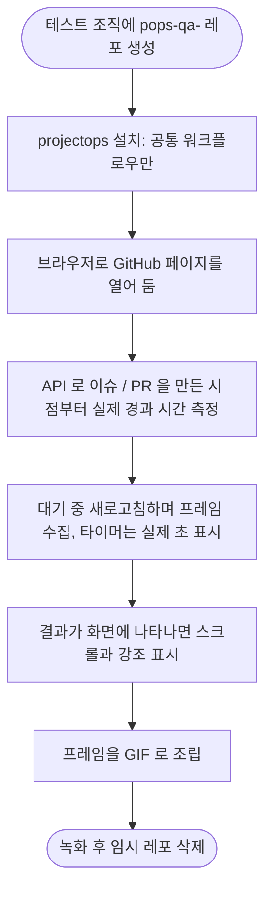

# 기능별 실제 동작 GIF로 README 데모 교체

## 개요
GitHub 화면 캡처 5장을 2.8초씩 넘기던 슬라이드쇼를, 기능 하나당 GIF 하나로 바꿨습니다. 테스트 조직(`git-sandboxes`)에 임시 레포를 만들어 projectops를 실제로 설치하고, 실제로 실행되는 과정을 GitHub 페이지로 녹화했습니다. README 4개 언어와 문서 사이트 랜딩(한국어·영어)에 반영했고, 릴리스 PR로 배포했습니다. 대상 이슈는 #760입니다.

## 기능 흐름

## 변경 사항
- `docs/images/feature-issue.gif`: 이슈를 열면 브랜치명과 커밋 메시지 템플릿이 댓글로 달리는 과정
- `docs/images/feature-pr-summary.gif`: 작업 PR을 열면 변경 요약이 댓글로 달리는 과정
- `docs/images/feature-release.gif`: 릴리스 PR이 열린 뒤 버전 확정, 릴리스 노트, 자동 머지, 태그 생성까지
- `README.md`, `docs/i18n/README.{en,zh-CN,ja}.md`, `docs/index.md`, `docs/en/index.md`: 슬라이드쇼를 위 GIF 3개와 설명으로 교체

## 주요 구현 내용
- **녹화 방식**: 브라우저로 실제 GitHub 페이지를 열어 두고, 이슈나 PR을 만든 시점부터의 **실제 경과 시간**을 화면 구석 타이머에 표시했습니다. 기다리는 구간만 빠르게 재생하고, 결과가 나타나면 스크롤하고 강조 표시를 붙였습니다. 단계 번호가 붙은 설명 바는 새로고침해도 유지됩니다.
- **측정된 실제 시간**: 이슈 안내 댓글 약 16~19초, PR 변경 요약 약 22~35초, 릴리스 PR 머지까지 약 52~64초였습니다. 시나리오마다 녹화 시점의 서버 상태에 따라 다릅니다.
- **환경**: 이 조직은 기본 워크플로 권한이 `read`이고 PR 승인이 불가능한 엄격한 설정이라, 실제 사용자 환경에 가깝습니다. 배포 워크플로우는 비밀 값 없이 실패하므로 공통 워크플로우만 설치했습니다.
- **릴리스는 기본 경로 그대로**: 릴리스 PR 본문을 비워 열어서, 워크플로우가 직접 릴리스 노트를 만들고 PR 제목에 버전을 반영하는 과정을 그대로 담았습니다. `feat` 커밋이라 minor가 올라가 `v1.1.0`, `v1.2.0`, `v1.3.0` 태그가 순서대로 생겼습니다.

## 검증
- 라이브 사이트(`https://cassiiopeia.github.io/projectops/`)에서 GIF 3개가 200으로 열리고, 응답 크기가 저장소 파일과 정확히 일치합니다. `main`의 파일도 `develop`과 같습니다.
- `npm test` 434개 통과, pytest 통과, 사이트 빌드 통과, README·사이트의 상대 링크 깨짐 0건.
- 녹화 후 임시 레포 `git-sandboxes/pops-qa-demo-gif`를 삭제했습니다. 설치 때 등록한 Secret도 레포와 함께 사라졌습니다.

## 주의사항
- **화면을 가공한 것은 한 가지입니다.** 한글 브랜치명에 GitHub이 띄우는 노란 경고 배너("hidden characters")만 화면에서 가렸습니다. 기능과 무관한 소음이고, README 캡션에 그 사실을 적었습니다. 나머지는 가공하지 않은 실제 화면입니다.
- **처음 만든 GIF는 결함이 있어 다시 만들었습니다.** 새로고침하면 설명 바가 비는 문제, "나타났다"는 판정이 체크 목록의 글자와 섞여 일찍 끝나는 문제, 첫 프레임이 빈 목록 화면인 문제를 라이브 사이트에서 발견해 각각 고쳤습니다. 지금 배포된 것이 고친 버전입니다.
- **이전 슬라이드쇼 파일이 남아 있습니다.** `docs/images/demo/`의 `demo.gif`와 `1-issue.webp` 등 6개 파일은 더 이상 어디에서도 참조되지 않습니다. 파일 삭제는 허락이 필요해서 지우지 않았습니다.
- **Agent Skills는 영상이 없습니다.** `/pro-github`, `/pro-commit`, `/pro-report`는 Claude Code 화면 안에서 동작해서 이번 방식(GitHub 페이지 녹화)으로는 담을 수 없었습니다.
- **녹화 스크립트는 저장소에 넣지 않았습니다.** 같은 방식으로 다시 만들려면 도구를 다시 작성해야 합니다. 필요하면 `tools/`로 정리할 수 있습니다.
- GIF에 보이는 버전 번호(`v1.2.0` 등)는 샘플 레포의 것이고 projectops 버전과 무관합니다.
