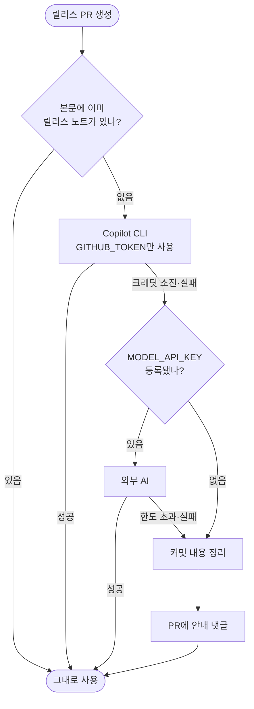

# 릴리스 노트 생성 경로 재설계

## 배경

2026년 7월 30일 GitHub Models가 완전 종료되면서, 신규 통합 저장소의 기본 provider
(`github-ai`)가 동작하지 않게 되었다. 조사 과정에서 관련 문제가 연달아 드러났다.

| 발견 | 확인 방법 |
|---|---|
| GitHub Models 종료 | API 직접 호출 → `HTTP 410` |
| `gemini-1.5-flash` 퇴역 | Google 모델 목록에 없음 |
| 커밋 파싱이 자체 컨벤션을 못 읽음 | 단위 실행 → 전부 "기타" 분류 |
| CodeRabbit이 실제로는 동작하지 않음 | 최근 PR 4건에 댓글 0개 |
| AI PR 요약이 스스로 빠짐 | `.coderabbit.yaml` 존재만으로 skip |
| 실패해도 안내가 없음 | job만 종료, PR에 설명 없음 |

마지막 두 개가 겹치면 **CodeRabbit도 요약을 안 하고 우리 요약도 안 하는** 상태가 된다.
실제로 이 저장소가 그 상태였다.

## 문제의 본질

사용자에게 **수단을 묻고 있었다.**

```
📝 릴리스 노트는 1순위로 뭘로 만들까요?
   1. GitHub AI (추천 · 설정 불필요)   ← 종료된 서비스
   2. CodeRabbit                      ← 응답 판정이 불확실
   3. OpenAI 호환 API (키 등록 필요)
   4. 커밋 분석만
```

사용자의 목적은 "릴리스 노트가 잘 나오는 것"이지 provider 선택이 아니다. 무엇을 골라야
할지 알 수 없는 질문이었고, 기본값마저 죽어 있었다.

## 설계 원칙

1. **묻지 않는다** — provider 질문을 없애고 워크플로우가 스스로 최선을 찾는다
2. **판정하지 않는다** — 외부 서비스의 실패 원인을 추론하지 않는다. 안 되면 다음으로 간다
3. **어떤 경우에도 결과가 나온다** — 최후 단계는 외부 의존이 없다
4. **막히면 알려준다** — 실패를 숨기지 않되, 실행 가능한 다음 행동을 함께 제시한다

## 생성 사다리



| 단계 | 조건 | 사용자가 할 일 |
|---|---|---|
| ① 본문 존중 | 이미 작성돼 있음 (배포 스킬·CodeRabbit·사람) | 없음 |
| ② Copilot CLI | 항상 시도 | **없음** |
| ③ 외부 AI | `MODEL_API_KEY`가 있을 때만 | 키 등록 (선택) |
| ④ 커밋 정리 | 위가 모두 안 될 때 | 없음 |

### CodeRabbit을 부르지도, 기다리지도 않는다

종전에는 워크플로우가 **직접 CodeRabbit을 호출한 뒤 최대 10분간 폴링**했다. 두 step이
한 쌍이다.

| 위치 | step | 동작 |
|---|---|---|
| L188 | CodeRabbit Summary 요청 | PR에 `@coderabbitai summary` 댓글 작성 |
| L202 | CodeRabbit Summary 감지 | 5초 간격 120회 = **10분 대기** |

응답이 없으면 그 10분을 전부 소비한 뒤 폴백했고, 응답 없음이 rate limit 때문인지
판별할 방법도 없었다. **요청을 보내지 않으면 기다릴 이유도 없으므로 두 step을 함께
제거한다.**

CodeRabbit은 **코드 리뷰 도구로만 남긴다** — PR에 다는 리뷰 댓글은 그대로 유용하다.
릴리스 노트는 위 사다리가 만든다. CodeRabbit이 본문에 요약을 달아두었다면 ①에서 자연히
존중되므로 손해가 없고, 릴리스는 기다림 없이 즉시 진행된다.

> 혼동 주의 — 이 문서에 나오는 댓글은 두 종류다.
> **제거**하는 것은 워크플로우가 CodeRabbit을 부르는 `@coderabbitai summary`이고,
> **신설**하는 것은 아래 "안내 댓글"(사용자에게 대안을 알리는 것)이다.

### Copilot CLI를 기본으로 두는 근거

실측으로 확인했다 (`PROJECT-TEMPLATE-COPILOT-PROBE`, run 35055288710).

| 항목 | 결과 |
|---|---|
| 개인 저장소 | 동작 |
| API 키 | **불필요** — `GITHUB_TOKEN` + `copilot-requests: write` |
| 설치 | `npm install -g @github/copilot` (4초) |
| 생성 | 5초 |
| 소모 | **Premium Request 1개** (입력 31.7k 토큰) |

출력 품질도 외부 AI에 뒤지지 않았다.

```
**새 기능**
* 실행 전 과정 진단 로그 제공
* 단계별 실행 시간 기록

**버그 수정**
* 설치 로그가 중간에 끊기던 문제 해결
```

다만 과금 단위가 **요청 수**라 한도가 빠듯하다. 릴리스 전용으로는 충분하지만 PR 요약까지
켜면 부족할 수 있어, 소진 시 ③으로 내려가는 경로가 필요하다.

### 외부 AI — 무료 제공처

전부 OpenAI 호환이라 `openai_compatible.py`에 preset만 추가하면 된다.

| 제공처 | 무료 한도 | 카드 |
|---|---|---|
| **Google Gemini** | RPD 500 (`gemini-flash-lite-latest` 기준, 실측) | 불필요 |
| Groq | 30 req/분 | 불필요 |
| Mistral | 월 약 10억 토큰 (데이터 학습 동의 시) | 불필요 |
| Cloudflare Workers AI | 일 10,000 Neurons | 불필요 |

OpenAI·Anthropic·Qwen은 **상시 무료 티어가 없다** (만료되는 체험 크레딧뿐).

**모델명은 별칭을 쓴다.** 버전이 박힌 이름은 1~2년이면 퇴역한다 — `gemini-1.5-flash`가
그렇게 죽었다. `gemini-flash-lite-latest`처럼 `-latest` 별칭을 사용한다.

| 별칭 | 실제 모델 | 무료 RPD |
|---|---|---|
| `gemini-flash-lite-latest` | Gemini 3.5 Flash Lite | **500** |
| `gemini-flash-latest` | Gemini 3.8 Flash | 20 |

상위 모델은 무료 등급에서 RPD 20이라 자동화에 부적합하다. **Lite를 기본으로 한다.**

### 커밋 정리 — 폴백 전용

커밋 컨벤션 파싱은 **폴백으로만** 둔다. 컨벤션을 지키지 않는 팀에서는 의미가 없으므로
주력 경로로 삼지 않는다. 다만 현재 자체 컨벤션조차 인식하지 못하는 것은 버그다.

```python
_PREFIX_RE = re.compile(r"^(feat|fix|...)(\([^)]*\))?:")   # 줄 맨 앞만 매치
```

| 형식 | 현재 | 수정 후 |
|---|---|---|
| `feat: 소셜 로그인 추가` | 새 기능 | 새 기능 |
| `로그인 개선 : feat : 소셜 로그인 추가` | **기타 (원문 노출)** | 새 기능 |

`classify_bump_level()`(#546)이 이미 두 형식을 모두 인식하므로 같은 규칙을 적용한다.

## 안내 댓글

단계가 내려갔을 때만, **한 번만** 남긴다.

```
릴리스 노트를 커밋 내용으로 정리했습니다.

AI 요약을 사용하려면 무료 키를 등록하세요 (2분, 카드 불필요):
  1. https://aistudio.google.com/apikey 에서 키 발급
  2. Settings → Secrets → Actions → MODEL_API_KEY 로 등록

또는 이 PR 본문에 직접 작성하시면 그대로 사용됩니다.
```

- **한 번만** — 본문 마커로 중복을 막는다. 매 릴리스마다 반복하지 않는다
- **실행 가능하게** — "실패했다"가 아니라 "이렇게 하면 됩니다"
- **선택지를 남긴다** — 키 등록이 싫으면 직접 작성하면 된다

## 마법사 변경

| 질문 | 현재 | 변경 후 |
|---|---|---|
| changelog provider | 4지선다 | **삭제** |
| CodeRabbit 코드 리뷰 | 예/아니오 | **PR 댓글을 어떻게 받을지**로 통합 |

```
PR에 리뷰·요약 댓글을 어떻게 받으시겠어요?
  1. CodeRabbit (코드 리뷰)
  2. AI 변경 요약 (projectops 자체 생성)
  3. 둘 다
  4. 사용 안 함
```

선택 결과가 워크플로우 **복사 여부**를 결정한다. 사용하지 않으면 파일 자체가 들어가지
않고, 껐을 때는 기존 파일을 정리한다.

## 배포 스킬과의 관계

`/pro-changelog-deploy`로 배포하면 스킬이 PR 본문에 릴리스 노트를 미리 작성한다.
그 경우 ①에서 존중되어 **사다리가 아예 돌지 않는다** (이 저장소의 릴리스 49건이 모두
그 경로였다).

즉 워크플로우의 생성 경로는 **스킬 없이 배포하는 사용자를 위한 안전망**이다. 그래서
"설정 없이 그냥 되는 것"이 더욱 중요하다.

## 범위 밖

- Copilot 크레딧 잔량 조회 — API가 공개돼 있지 않다. 소진은 호출 실패로만 감지한다
- `.coderabbit.yaml` 자동 삭제 — 코드 리뷰 용도로 계속 쓰므로 건드리지 않는다
- 모델 품질 자동 평가 — 사람이 결과를 보고 판단한다

## 관련

- #566 (이 설계의 근거 이슈) · #553 (AI PR 요약) · #546 (bump 분류기 — 두 컨벤션 인식)
- #564 (`pr_body.md` 오염) · #565 (릴리스 유령 실패) — 같은 워크플로우를 건드리므로 함께 처리
