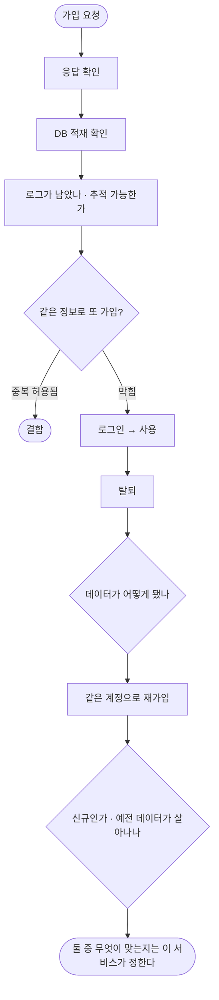

# pro-agent-test 재설계 — 가이드라인을 주는 스킬로

`2026-09-18-pro-agent-test-design.md`가 앱·웹·서버를 밟는 **틀**을 세웠다면, 이 문서는
**스킬이 무엇을 하는 물건인가**를 다시 잡는다.

## 이 스킬은 QA다

코드를 고치는 물건이 아니다. **버그를 찾아내는 물건이다.**

| 하는 일 | 하지 않는 일 |
|---|---|
| 깨뜨려 보고 **결함을 찾는다** | 찾은 결함을 고친다 |
| 재현 절차와 근거를 남긴다 | 코드를 바꾼다 |
| 심각도를 매겨 보고한다 | 어떻게 고칠지 정한다 |

이 구분이 모든 것을 바꾼다. 예를 들어 **로그가 없을 때**:

- 개발자라면 → "로깅을 추가하자"
- **QA라면 → "추적 불가"를 결함으로 보고한다**

고치는 것은 개발자 몫이고, 그건 다른 스킬(`superpowers:*`·`pro-implement`)의 일이다.
여기서 코드를 고치기 시작하면 **무엇이 원래 결함이었는지 알 수 없게 된다.**

### 목적은 통과가 아니라 발견이다

해피 패스만 밟고 "통과"라고 하면 QA가 아니다. 정상 경로는 개발자가 이미 수십 번 밟았다.
**버그는 그 바깥에 있다.**

> 통과했다고 보고할 때보다 **결함을 하나 찾았을 때 제 역할을 한 것이다.**

그래서 밟을 목록을 정할 때 "되는지 확인"이 아니라 **"어디가 깨질까"** 로 생각한다.

## 무엇이 잘못됐나

py가 **"프로젝트가 어떻게 생겼는지 알아맞히는 일"** 을 하고 있다. 그건 py가 할 수 없는 일이다.
세상의 서버 종류만큼 예외가 있다.

**세 타겟 전부가 같은 병을 앓고 있다.** 서버만의 문제가 아니다.

### 서버

| 박혀 있는 것 | 무엇을 전제하나 | 남의 프로젝트에서 |
|---|---|---|
| `_find_spring_config` | `**/src/main/resources/application-prod.yml` | Django·Express·Rails → 못 찾음 |
| `_read_spring_config` | Spring yml 구조를 정규식으로 | 다른 형식 → 못 읽음 |
| `_ADMIN_DEFAULTS` | **`/admin/login` · `/admin/logs/api/tail`** | 그런 엔드포인트가 없음 |
| `_orphan_scan` | PostgreSQL `information_schema` + `%_id` 명명 | 다른 DB·명명 → 안 됨 |

`/admin/logs/api/tail`은 **한 프로젝트의 엔드포인트가 오픈소스 스킬 코드에 들어 있는 것**이다.

### 앱

| 박혀 있는 것 | 무엇을 전제하나 | 안 맞으면 |
|---|---|---|
| `_find_flutter_root` | `pubspec.yaml`에 `flutter:` | **React Native는 아예 안 된다** (app 타겟이라 해놓고) |
| `_scan_feature_groups` | `lib/features/` 폴더가 있다 | `lib/src/`·`lib/ui/`·레이어드 구조 → 빈 목록 |
| `_scan_screens` | 파일명이 `*_screen.dart` | `*_page.dart`·`*_view.dart` → 못 찾음 |
| `_scan_routes` | `static const x = '/...'` | `GoRoute(path:)`를 직접 쓰면 → 못 찾음 |
| `_scan_auth` | Provider enum 패턴 | 다른 방식이면 → 못 읽음 |

`lib/features`·`*_screen.dart`는 **한 프로젝트의 폴더 규칙**이다. 같은 Flutter라도 구조가
다르면 아무것도 못 찾는다.

### 웹

| 박혀 있는 것 | 무엇을 전제하나 | 안 맞으면 |
|---|---|---|
| `_scan_web` | `app/`·`pages/`·`src/` + Next.js 파일 규칙 | Vite·Remix·Nuxt·SvelteKit → 어긋남 |
| 라우트 추출 | `path: '...'` 문자열 | 다른 라우터 표기 → 못 찾음 |

---

**공통점은 하나다.** py가 "이 프로젝트는 이렇게 생겼을 것"이라고 **가정**하고, 그 가정이
틀리면 조용히 빈손으로 돌아온다. 사용자에게는 "아무것도 못 찾았다"로만 보인다.

더 근본적으로는 **시나리오를 사람이 다 적어야 한다.** 사람이 사람에게 시킬 때는
"회원가입 API 좀 테스트해줘" 한 마디면 되는데, 지금은 JSON을 손으로 채워야 한다.
방향이 뒤집혀 있다.

## 역할을 다시 나눈다

| 누가 | 무엇을 | 예 |
|---|---|---|
| **SKILL.md** | 판단 **기준**을 준다 | "권한은 이렇게 깨뜨려 본다" |
| **agent** | 프로젝트를 읽고 **판단한다** | 설정이 어디 있는지, 누가 자원의 주인인지 |
| **기록** (`access`·`learned`) | 알아낸 것을 **쌓는다** | 다음 실행이 여기서 시작한다 |
| **py** | 기계적인 것만 **실행한다** | adb · 브라우저 · HTTP · SQL · 파일 |

**py는 찾지 않는다. 맞히지 않는다. 판단하지 않는다.** 받은 대로 실행하고 결과를 그대로 돌려준다.

그래서 스킬은 쓸수록 똑똑해진다 — 알아낸 것이 기록에 쌓이고, 다음 실행은 거기서 출발한다.

## 백엔드 테스트는 무엇인가

프론트는 **화면**이 판정 근거다. 눈으로 보면 된다.
백엔드는 화면이 없으니 **상태 변화**가 판정 근거다. 그런데 —

> **응답 201을 받아도 DB에 없을 수 있다.**

그래서 백엔드는 언제나 **세 곳을 함께** 본다.

```
응답 (status · body)  +  저장소 (DB · 캐시 · 파일)  +  흔적 (로그 · 외부 호출)
```

### 회원가입을 테스트한다면

단발 API 호출이 아니다. **생애주기 전체**다.



**탈퇴 후 재가입**이 특히 그렇다. 여기서 드러나는 것들:

- 탈퇴가 진짜 삭제인가, 플래그만 바꾸는가
- 재가입할 때 예전 데이터가 딸려오는가 (개인정보 문제가 될 수 있다)
- 유니크 제약이 탈퇴한 계정을 붙잡고 있어 재가입이 막히는가
- 탈퇴 후 남은 토큰으로 API가 여전히 되는가 ← **자주 빠진다**

## 놓치지 말아야 할 것들

순서까지 포함해 이렇다. SKILL.md가 이 목록을 체크리스트로 준다.

| 순위 | 무엇 | 왜 이 순서인가 |
|---|---|---|
| 1 | **권한 경계** | 프론트에서 버튼을 숨겨도 API는 열려 있다. 그리고 **거의 아무도 안 밟아본다** |
| 2 | **상태 대조** | 응답과 실제 저장이 어긋난다. 트랜잭션 롤백·비동기에서 흔하다 |
| 3 | **관측성** | 실패했을 때 **추적할 수 있는가**. 아래 별도 절 |
| 4 | **실패 구분** | 400/401/403/404/409를 구분해 주나. 전부 500이면 클라이언트가 대응 못 한다 |
| 5 | **멱등·중복** | 같은 요청 두 번. 네트워크 재시도로 실제로 자주 일어난다 |
| 6 | **동시성** | 같은 자원을 동시에. 재고·포인트·좌석에서 터진다 |
| 7 | **정리** | 테스트가 남긴 데이터. 안 지우면 두 번째 실행이 깨진다 |

**1번이 1등인 이유**: 나머지는 개발자가 어느 정도 밟아보지만, "남의 계정으로 남의 데이터
조회"는 거의 아무도 안 해본다. 그리고 그건 **코드를 읽어야** 안다 — 누가 자원의 주인인지
알아야 깨뜨려볼 수 있다. 정확히 agent가 할 일이다.

## 관측성을 평가해 돌려준다 (이 스킬의 차별점)

보통의 E2E 도구는 **통과/실패**만 본다. 이 스킬은 한 걸음 더 간다.

> **"이 실패를 나중에 제보받았을 때, 로그만으로 원인을 찾을 수 있는가?"**

밟는 동안 이것을 함께 본다.

| 보는 것 | 통과 | 결함 |
|---|---|---|
| 요청 추적 | 요청마다 식별자가 있고 로그에서 이어진다 | 로그가 있어도 어느 요청인지 못 잇는다 |
| 실패 기록 | 어디서 왜 실패했는지 남는다 | 스택트레이스만 있고 입력이 없다 |
| 사용자 노출 | 화면에 **에러 코드**가 보인다 | "오류가 발생했습니다"만 — 제보받아도 못 찾는다 |
| 민감정보 | 비밀번호·토큰이 마스킹된다 | 로그에 원문이 남는다 ← **결함으로 보고한다** |

**로그가 아예 없으면 그 자체가 결함이다.** "추적 불가"로 보고한다 — 로깅을 대신 넣어 주지 않는다.
없는 채로 밟으면 "화면은 넘어갔는데 저장이 됐는지" 알 수 없어 통과 판정이 추측이 되므로,
그 상태에서 내린 판정에는 **"근거 부족"을 함께 적는다.**

이 결과는 기능 결함과 **별도 항목**으로 보고한다 — 기능은 되는데 추적이 안 되는 상태가
실제로 가장 흔하고, 그게 다음 장애 때 원인을 못 찾는 이유가 된다.

## 결과물은 결함 리포트다

"몇 개 통과"가 아니라 **무엇이 잘못됐는지**가 결과물이다. 각 결함에 이것이 있어야 개발자가
받아서 바로 고칠 수 있다.

| 담는 것 | 왜 |
|---|---|
| **재현 절차** | 그대로 따라 하면 다시 나야 한다. 안 나면 고쳤는지 확인할 수 없다 |
| **기대 vs 실제** | "이상하다"가 아니라 "403이어야 하는데 200이 왔다" |
| **근거** | 응답 원문 · DB 조회 결과 · 로그 · 스크린샷 |
| **심각도** | 아래 기준 |
| **영향 범위** | 이 결함으로 무엇이 가능해지는가 |

### 심각도

| 등급 | 기준 | 예 |
|---|---|---|
| **치명** | 데이터가 새거나 망가진다 | 남의 자원 조회·수정 가능, 비밀번호가 로그에 남음 |
| **높음** | 주요 흐름이 막힌다 | 가입·결제·로그인이 특정 조건에서 실패 |
| **보통** | 우회할 수 있다 | 에러 메시지가 원인을 안 알려줌, 중복 생성됨 |
| **낮음** | 불편하다 | 응답이 느림, 문구가 어색함 |
| **관측성** | 기능은 되는데 추적이 안 된다 | 로그 없음, 에러 코드 미노출 |

**추측으로 심각도를 올리지 않는다.** "털릴 수도 있다"가 아니라 **실제로 밟아서 된 것**만
치명으로 적는다. 밟아보지 못했으면 그렇다고 적는다.

## 시나리오는 입력이 아니라 산출물

```
지금:   사람이 시나리오를 다 적는다  →  py가 그대로 실행한다
바꾼 뒤: 사람이 "회원가입 테스트해줘"  →  agent가 코드를 읽어 계약을 파악
        →  밟을 목록을 만들어 보여주고 승인받고  →  밟고  →  기록으로 남긴다
```

agent가 만든 시나리오는 다음 실행에서 재사용된다. **두 번 이상 밟을 경로일 때만** 파일로
남기는 기존 원칙은 유지한다 — 한 번 보고 끝날 확인까지 파일로 만들면 관리 대상만 늘어난다.

## 대상 환경을 반드시 확인한다

백엔드 고유의 위험이다. **운영에 밟으면 사고다.**

- 밟기 전에 `base_url`과 DB가 어디를 가리키는지 **사용자에게 보여주고 확인받는다**
- 계정을 만들고 지우는 시나리오는 특히 그렇다
- 기록(`access`)에 환경을 나눠 적는다 — `local` · `staging` · `prod`

## 걷어낼 것

| 대상 | 어떻게 |
|---|---|
| `cmd_backend` · `_find_spring_config` · `_read_spring_config` | 제거. `access`(기록) + `db`/`logs`(실행)가 대신한다 |
| `_ADMIN_DEFAULTS` · `_admin_log_tail` | 제거. 로그 보는 법은 프로젝트마다 다르고 agent가 알아내 기록한다 |
| `_orphan_scan` | 제거. 도메인 지식이다 — 필요하면 agent가 SQL을 써서 `db`로 돌린다 |
| **모든 타겟의 스캐너** (`_scan_feature_groups`·`_scan_screens`·`_scan_routes`·`_scan_web`·`edges`) | **남기되 역할을 낮춘다.** 정답이 아니라 **후보**다 |
| 예시 속 고유명 (`elum.refreshToken` · `login-kakao`) | 일반적인 표현으로 |

### 스캐너를 남기는 이유와 지켜야 할 것

큰 저장소에서 agent가 파일을 전부 읽을 수는 없다. **후보를 빠르게 모아 주는 것**에는 값어치가
있다. 다만 지켜야 할 것이 있다.

1. **정답인 척하지 않는다.** 출력에 "이건 흔한 규칙으로 찾은 후보이고, 맞는지는 코드를 보고
   판단하라"는 뜻이 담겨야 한다.
2. **빈손일 때 그냥 비워 두지 않는다.** "못 찾았다"가 아니라 **"이 규칙으로 찾아봤는데 없다.
   구조가 다를 수 있으니 직접 읽어라"** 라고 말한다. 지금은 조용히 빈 목록을 준다 —
   사용자는 프로젝트에 화면이 없는 줄 안다.
3. **무엇을 근거로 찾았는지 함께 준다.** `lib/features`를 봤는지, `*_screen.dart`를 봤는지
   알려 줘야 agent가 "우리는 다른 구조인데" 하고 방향을 바꾼다.

이 세 가지는 **앱·웹·서버 모두에 똑같이 적용된다.**

## 무엇을 만들 것인가

### SKILL.md — 가이드라인 문서로

"이렇게 실행해라"가 아니라 **"무엇을 놓치지 마라"**. 타겟이 정해지면 그 문서를 읽는 구조는
유지한다.

`references/target-server.md`에 위 체크리스트를 **깨뜨리는 방법과 함께** 적는다. 예:

> **권한은 이렇게 깨뜨려 본다.** 자원에 주인이 있는지 코드에서 확인한다
> (`userId` 비교 · `@PreAuthorize` · 쿼리의 `where owner_id = ?`).
> 있으면 **계정 두 개로 밟는다** — A로 만들고 B로 조회·수정·삭제해 본다.
> 403이 아니라 200이 오면 그 자리가 구멍이다.

### py — 실행 수단만

이미 있는 것: `api`(HTTP 시퀀스) · `db`(SQL) · `logs`(로그) · `web`(브라우저) · `access`(기록)

더할 것:

| 무엇 | 왜 |
|---|---|
| `api --repeat N --concurrency C` | 동시성·멱등을 밟으려면 같은 요청을 겹쳐 보낼 수단이 필요하다 |
| `api --as <프로필>` | 계정을 바꿔 가며 밟는다. 권한 경계 확인의 전제 |

둘 다 **판단하지 않는다.** 몇 번을 어떤 계정으로 보낼지는 agent가 정한다.

## 하지 않을 것

- **코드 수정** — 결함을 찾아 보고까지만 한다. 고치는 것은 다른 스킬의 일이고, 여기서
  고치기 시작하면 무엇이 원래 결함이었는지 알 수 없게 된다
- **부하 테스트** — 범위에서 뺀다. `mode: load` 축은 제거한다
- **DB 엔진 자동 판별** — 무엇으로 붙을지는 기록에 적힌 대로 한다
- **설정 파일 자동 탐색** — 정규식으로 맞히려는 시도는 성립하지 않는다

## 호환성

- 기존 시나리오(`target`·`mode` 없는 파일)는 계속 `app`·`e2e`로 동작한다
- `cmd_backend`를 쓰던 호출은 **명확한 안내로 대체한다** — 조용히 사라지면 쓰던 사람이 당황한다
- 쌓인 `learned.json`은 건드리지 않는다
