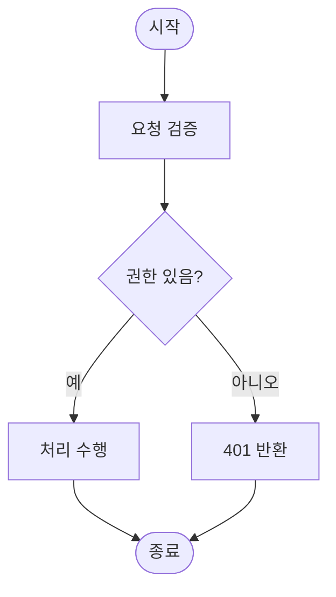

# 보고서 출력 틀 · mermaid 흐름도 규칙

> 언제 읽나: 보고서 본문을 쓰기 시작할 때(출력 틀), 흐름도를 그릴지 판단하거나 그릴 때.

## 출력 틀

```markdown
# [이슈 제목]

## 개요
[한 문단 요약]

## 기능 흐름
[흐름도가 필요하다고 판단한 경우에만 작성. 전체 그림을 먼저 보여준 뒤 상세 변경으로 이어진다.]

## 변경 사항

### [카테고리 1]
- `파일경로`: [변경 내용 설명]

### [카테고리 2]
- `파일경로`: [변경 내용 설명]

## 주요 구현 내용
[핵심 로직/접근 방식 설명]

## 주의사항
[특이사항, 추후 개선점]
```

## 흐름도 필요 여부

변경이 **다단계 처리·분기·상태 전이·여러 컴포넌트 협력**을 포함하면 흐름도를 그린다.
단순 변경(텍스트 수정, 설정값 조정, 단일 함수 내부 로직)은 흐름도를 **생략**한다 — 무의미한 다이어그램은 노이즈.

| 흐름도 그림 | 흐름도 생략 |
|---|---|
| 요청→검증→처리→응답 같은 다단계 파이프라인 | 상수값·문구 수정 |
| 조건 분기(권한 체크, 상태별 처리) | 단일 함수 리네임/포매팅 |
| 상태 전이(대기→진행→완료) | 설정 파일 한 줄 변경 |
| 여러 파일/서비스가 협력하는 흐름 | 의존성 버전 업 |

## mermaid 작성 규칙

GitHub 이슈·PR·댓글은 ` ```mermaid ` 코드 블록을 그대로 렌더링한다. 아래 규칙을 지켜야 깨지지 않는다.

````markdown
## 기능 흐름


````

- **[중요] subgraph 선언 시 공백/한글/괄호() 혼용 제한**: `subgraph` 자체의 식별자(ID)에 한글, 공백, 괄호`()`가 들어가면 GitHub 렌더러가 `Unable to render rich display` 파싱 에러를 유발한다. 화면에 노출할 텍스트는 반드시 `subgraph ID ["표시할 텍스트"]` 와 같이 ID와 철저히 분리 정의해야 한다.
  * 올바르지 않은 예: `subgraph 생성 단계 (create-issue)` (공백, 괄호로 인해 렌더링 실패)
  * 올바른 예: `subgraph create_phase ["생성 단계 (create-issue)"]` (영문/스네이크 ID 정의 및 대괄호 레이블 명시)
- **코드 펜스는 반드시 ` ```mermaid `** — `mermaidjs`·`mermaid-js` 등은 GitHub에서 렌더링되지 않는다.
- **[가독성] flowchart TD (위→아래) 흐름 강제**: 가로형 흐름도(`flowchart LR`)는 모바일이나 축소된 뷰포트 UI 환경에서 불필요한 가로 스크롤을 무한 유발하여 가독성을 저해한다. 따라서 가로 구조를 배제하고 위에서 아래로 순차 하강하는 `flowchart TD` 흐름 명세를 강제 정합화한다.
- 시작/종료: `(["텍스트"])` (둥근 사각형). 처리: `["텍스트"]` (사각형). 조건: `{"텍스트?"}` (다이아몬드).
- 분기 레이블: **`C -->|예| D` 파이프 문법** 사용 — 한글 레이블에서 `-- 예 -->`보다 안정적.
- 한글·특수문자 노드 텍스트는 항상 `["..."]`로 감싼다.
- **노드 텍스트 내 `\n` 금지** — 리터럴 `\n`으로 표시된다. 줄바꿈이 필요하면 `["1단계<br/>2단계"]`처럼 `<br/>`를 쓰거나 노드를 분리한다.
- **self-loop 금지** — `A --> A`는 렌더링이 깨진다. "재시도", "대기" 등 별도 노드로 분리한다.
- **`curve: linear` config 블록 금지** — 화살표가 이상하게 꺾인다.
- **다이아몬드 텍스트는 짧게**(3~5단어) — 상세 설명은 분기 레이블이나 주변 노드에 둔다.
- 복잡한 흐름은 `subgraph`로 그룹화한다.
